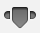

# 添加数据

本教程以第二个教程（“[教程：串联图](series-figure.md)”）中创建的项目为基础。您将用到从使用设计模式、使用 Foundation 以及编写自定类中学到的知识，在 ToDoList 应用程序中添加对动态数据的支持。

本教程讲述了以下操作：
 
- 使用常见的 Foundation 类
- 创建自定数据类
- 实现委托和数据源协议
- 在视图控制器之间传递数据

完成本教程中的所有步骤后，您的应用程序外观大致是这样的：


## 创建数据类

现在就开始吧，请在 Xcode 中打开您的现有项目。

目前，使用串联图的 ToDoList 应用程序有一个界面和一个导航方案。现在，是时候使用模型对象来添加数据储存和行为了。

应用程序的目标在于创建一个待办事项列表，因此首先您将创建一个自定类 XYZToDoItem 来表示单个待办事项。您应该记得，XYZToDoItem 类已经在编写自定类中讨论过。

### 创建 XYZToDoItem 类

- 选取“File”>“New”>“File”（或按下 Command-N）。
- 这时将会出现一个对话框，提示您为新文件选取模板。
- 从左侧的 iOS 下方选择“Cocoa Touch”。
- 选择“Objective-C Class”，并点按“Next”。
- 在“Class”栏中，在 XYZ 前缀后键入 ToDoItem。
- 从“Subclass of”弹出式菜单中选取“NSObject”。
- 如果您完全按照本教程操作，那么在这个步骤之前，“Class”标题可能是 XYZToDoItemViewController。选取 NSObject 作为“Subclass of”后，Xcode 会知道您创建了一个正常的自定类，并移除了它先前添加的ViewController 文本。
- 点按“Next”。
- 存储位置默认为您的项目目录。此处无需更改。
- “Group”选项默认为您的应用程序名称“ToDoList”。此处无需更改。
- “Targets”部分默认选定您的应用程序，未选定应用程序的测试。好极了，这些都无需更改。
- 点按“Create”。

XYZToDoItem 类很容易实现。它具有项目名称、创建日期，以及该项目是否已完成等属性。继续将这些属性添加到 XYZToDoItem 类接口。

### 配置 XYZToDoItem 类

在项目导航器中，选择 XYZToDoItem.h。
将以下属性添加到该接口，使声明如下所示：

```
@interface XYZToDoItem : NSObject
 
@property NSString *itemName;
@property BOOL completed;
@property (readonly) NSDate *creationDate;
 
@end
```

检查点：通过选取“Product”>“Build”（或按下 Command-B）来生成项目。尽管该新类尚未实现任何功能，但是生成它有助于编译器验证任何拼写错误。如果发现错误，请及时修正：通读编辑器提供的警告或错误，然后回顾本教程中的说明，确保所有内容与此处的描述相符。

## 载入数据

您现在有一个类，可以用它作为基础来为单个列表项目创建并储存数据。您还需要保留一个项目列表。在 XYZToDoListViewController 类中跟踪此内容较为合适，视图控制器负责协调模型和视图，所以需要对模型进行引用。

Foundation 框架有一个 NSMutableArray 类，很适合跟踪项目列表。此处必须使用可变数组，这样用户就可以将项目添加到数组。因为不可变数组 NSArray 在其初始化后将不允许添加项目。

要使用数组，您需要声明并创建它。可以通过分配并初始化数组来完成。

### 要分配并初始化数组

1.在项目导航器中，选择 XYZToDoListViewController.m。

由于项目数组是表格视图控制器的实现细节，所以应该在 .m 文件中进行声明，而不是 .h 文件。此操作可让项目数组成为您自定类的私有数组。

2.将以下属性添加到接口类别中，它是由 Xcode 在您的自定表格视图控制器类中创建的。声明应该是这样的：

```
@interface XYZToDoListViewController ()
 
@property NSMutableArray *toDoItems;
 
@end
```

3.在 viewDidLoad 方法中分配并初始化 toDoItems 数组：

```
- (void)viewDidLoad
{
    [super viewDidLoad];
    self.toDoItems = [[NSMutableArray alloc] init];
}
```

viewDidLoad 的实际代码中有一些附加行被注释掉了，那些行是 Xcode 创建 XYZListViewController 时插入的。保留与否都没有影响。

现在，您已经拥有了一个可以添加项目的数组。添加项目将在单独的方法 loadInitialData 中进行，并将通过 viewDidLoad 调用该方法。由于此代码是一个模块化任务，所以会进入其自身的方法中。当然您也可以将方法分离出来，从而提高代码的可读性。在真正的应用程序中，此方法可能会从某种永久储存形式载入数据，例如文件。现在，我们的目标是了解表格视图如何处理自定数据项目，那么让我们创建一些测试数据来体验一下吧。

以创建数组的方式创建项目：分配并初始化。然后，给项目命名。该名称将显示在表格视图中。按照此方法创建一组项目。

### 载入初始数据

在 @implementation 行下方，添加一个新方法 loadInitialData。

```
- (void)loadInitialData {
}
```

在此方法中，创建几个列表项目，并将它们添加到数组。

```
- (void)loadInitialData {
    XYZToDoItem *item1 = [[XYZToDoItem alloc] init];
    item1.itemName = @"Buy milk";
    [self.toDoItems addObject:item1];
    XYZToDoItem *item2 = [[XYZToDoItem alloc] init];
    item2.itemName = @"Buy eggs";
    [self.toDoItems addObject:item2];
    XYZToDoItem *item3 = [[XYZToDoItem alloc] init];
    item3.itemName = @"Read a book";
    [self.toDoItems addObject:item3];
}
```

在 viewDidLoad 方法中调用 loadInitialData。

```
- (void)viewDidLoad
{
    [super viewDidLoad];
    self.toDoItems = [[NSMutableArray alloc] init];
    [self loadInitialData];
}
```

检查点：通过选取“Product”>“Build”来生成项目。您应该会在 loadInitialData 方法的代码行上看到大量错误。第一行是出错的关键所在，错误提示应该是“Use of undeclared identifier XYZToDoItem”。这说明编译器在编译 XYZToDoListViewController 时不知道 XYZToDoItem。编译器比较特别，您需要明确告知它应当注意什么。

### 让编译器注意您的自定列表项目类

在 XYZToDoListViewController.m 文件的顶部附近找到 #import "XYZToDoListViewController.h" 行。
紧接着在其下方添加以下行：

```
#import "XYZToDoItem.h"
```

检查点：通过选取“Product”>“Build”来生成项目。项目生成时应该没有错误。

## 显示数据

目前，表格视图具有一个可变数组，预填充了几个示例待办事项。现在您需要在表格视图中显示数据。

通过让 XYZToDoListViewController 成为表格视图的数据源，可以实现这一点。无论要让什么成为表格视图的数据源，都需要实施 UITableViewDataSource 协议。需要实施的方法正是您在第二个教程中注释掉的那些。创建有效的表格视图需要三个方法。第一个方法是 numberOfSectionsInTableView:，它告诉表格视图要显示几个部分。对于此应用程序，表格视图只需要显示一个部分，所以实现比较简单。

### 在表格中显示一个部分

- 在项目导航器中，选择 XYZToDoListViewController.m。
- 如果您在第二个教程中注释掉了表格视图数据源方法，现在请移除那些注释标记。
- 模板实现的部分如下所示。

```
- (NSInteger)numberOfSectionsInTableView:(UITableView *)tableView
{
#warning Potentially incomplete method implementation.
    // Return the number of sections.
    return 0;
}
```

您想要单个部分，所以需要移除警告行并将返回值由 0 更改为 1。

- 更改 numberOfSectionsInTableView: 数据源方法以便返回单个部分，像这样：

```
- (NSInteger)numberOfSectionsInTableView:(UITableView *)tableView
{
    // Return the number of sections.
    return 1;
}
```

下一个方法 tableView:numberOfRowsInSection: 告诉表格视图要在给定部分中显示几行。现在表格中有一个部分，并且每个待办事项在表格视图中都应该有它自己的行。这意味着行数应该等于 toDoItems 数组中的 XYZToDoItem 对象数。

### 返回表格中的行数

在项目导航器中，选择 XYZToDoListViewController.m。

您可看到模板实现的部分是这样的：

```
- (NSInteger)tableView:(UITableView *)tableView numberOfRowsInSection:(NSInteger)section
{
#warning Incomplete method implementation.
    // Return the number of rows in the section.
    return 0;
}
```

您想要返回所拥有的列表项目的数量。幸运的是，NSArray 有一个很方便的方法，称为 count，它会返回数组中的项目数，因此行数是 [self.toDoItems count]。

更改 tableView:numberOfRowsInSection: 数据源方法，使其返回正确的行数。

```
- (NSInteger)tableView:(UITableView *)tableView numberOfRowsInSection:(NSInteger)section
{
    // Return the number of rows in the section.
    return [self.toDoItems count];
}
```

最后一个方法，tableView:cellForRowAtIndexPath: 请求一个单元格来显示给定行。到现在为止，您只是处理了代码，但是界面的绝大部分是针对行显示的单元格。幸运的是，Xcode 可让您轻松地在 Interface Builder 中设计自定单元格。首个任务是设计您的单元格，并告诉表格视图不要使用静态内容，而要使用具有动态内容的原型单元格。

### 配置表格视图

- 打开串联图。
- 在大纲中选择表格视图。
- 选定表格视图后，在实用工具区域中打开“Attributes”检查器 。
- 在“Attributes”检查器中，将表格视图的“Content”属性从“Static Cells”更改为“Dynamic Prototypes”。

Interface Builder 会采用您配置的静态单元格，并将它们全部转换为原型。原型单元格，顾名思义，是使用您要显示的文本样式、颜色、图像或其他属性进行配置，并在运行时从数据源获取其数据的单元格。数据源会为每一行载入一个原型单元格，然后配置该单元格来显示该行的数据。

要载入正确的单元格，数据源需要知道单元格的名称，并且该名称也必须在串联图中进行配置。

设定原型单元格名称时，也将配置另一个属性—单元格选择样式，该样式用于确定用户轻按单元格时单元格的外观。将单元格选择样式设定为“None”，使用户轻按单元格时单元格不会高亮显示。这是当用户轻按待办事项列表中的项目，将其标记为已完成或未完成时，您想要单元格呈现的行为。稍后会在本教程中实现该功能。

### 配置原型单元格

- 在表格中选择第一个表格视图单元格。
- 在“Attributes”检查器中，找到“Identifier”栏并键入 ListPrototypeCell。
- 在“Attributes”检查器中，找到“Selection”栏并选取“None”。

您也可以更改原型单元格的字体或其他属性。基本配置很容易完成，您可以轻松记下。

下一步是实现 tableView:cellForRowAtIndexPath: 方法，让数据源为给定行配置单元格。表格视图在想要显示给定行时会调用此数据源方法。对于行数较少的表格视图，所有行可能会同时出现在屏幕上，所以表格中的每一行都会调用此方法。但是，行数很多的表格视图在给定时间内只会显示全部项目中的一小部分。最有效的方式是让表格视图仅请求要显示行的单元格，而这一点可通过 tableView:cellForRowAtIndexPath: 让表格视图实现。

对于表格中的任何给定行，取回 toDoItems 数组中的相应条目，然后将单元格的文本标签设定为项目的名称。

### 在表格中显示单元格

在项目导航器中，选择 XYZToDoListViewController.m。

找到 tableView:cellForRowAtIndexPath: 数据源方法。模板实现是这样的：

```
- (UITableViewCell *)tableView:(UITableView *)tableView cellForRowAtIndexPath:(NSIndexPath *)indexPath
{
    static NSString *CellIdentifier = @"Cell";
    UITableViewCell *cell = [tableView dequeueReusableCellWithIdentifier:CellIdentifier forIndexPath:indexPath];
 
    // Configure the cell...
 
    return cell;
}
```

该模板执行多个任务。它会创建一个变量来保存单元格的标识符，向表格视图请求具有该标识符的单元格，添加一个注释注明配置该单元格的代码应该写在哪里，然后返回该单元格。

要让此代码为您的应用程序所用，需要将标识符更改为您在串联图中设定的标识符，然后添加代码来配置该单元格。

将单元格标识符更改为您在串联图中设定的标识符。为了避免拼写错误，请将串联图中的标识符拷贝并粘贴到实现文件中。该单元格标识符行现在应该是这样的：

```
static NSString *CellIdentifier = @"ListPrototypeCell";
```

在 return 语句前，添加以下代码行：

```
XYZToDoItem *toDoItem = [self.toDoItems objectAtIndex:indexPath.row];
cell.textLabel.text = toDoItem.itemName;
```

您的 tableView:cellForRowAtIndexPath: 方法应如下图所示：

```
- (UITableViewCell *)tableView:(UITableView *)tableView cellForRowAtIndexPath:(NSIndexPath *)indexPath
{
    static NSString *CellIdentifier = @"ListPrototypeCell";
    UITableViewCell *cell = [tableView dequeueReusableCellWithIdentifier:CellIdentifier forIndexPath:indexPath];
    XYZToDoItem *toDoItem = [self.toDoItems objectAtIndex:indexPath.row];
    cell.textLabel.text = toDoItem.itemName;
    return cell;
}
```

检查点：运行您的应用程序。您在 loadInitialData 中添加的项目列表应该在表格视图中显示为单元格。

## 将项目标记为已完成

如果无法将待办事项列表中的项目标记为已完成，那么这个待办事项列表还不够好。现在，让我们来添加这样的支持。一个简单的界面应该可以在用户轻按单元格时切换完成状态，并在已完成的项目旁边显示勾号。幸运的是，表格视图附带了一些内建行为，您可以利用这些行为来实现这样的简单界面。需要注意的是，在用户轻按单元格时，表格视图要通知它们的委托。所以我们的任务是写一段代码，对用户轻按表格中的待办事项这个操作作出响应。

您在串联图中配置 XYZToDoListViewController 时，Xcode 就已经让它成为表格视图的委托了。您要做的只是实现 tableView:didSelectRowAtIndexPath: 委托方法，使其响应用户轻按，并在适当时候更新您的待办事项列表。

选定单元格后，表格视图会调用 tableView:didSelectRowAtIndexPath: 委托方法，来查看它应如何处理选择操作。在此方法中，您需要编写代码来更新待办项目的完成状态。

将项目标记为已完成或未完成

在项目导航器中，选择 XYZToDoListViewController.m。

将以下代码行添加到文件末尾，在 @end 行正上方：

```
#pragma mark - Table view delegate
 
- (void)tableView:(UITableView *)tableView didSelectRowAtIndexPath:(NSIndexPath *)indexPath
{
 
}
```

请试着键入第二行，而不是拷贝和粘贴。您将发现代码补全是 Xcode 最节省时间的功能之一。当 Xcode 显示出可能的补全建议列表时，请滚动浏览列表，找到想要的建议，然后按下 Return 键。Xcode 会为您插入整行。

您想要响应轻按，但并不想让单元格保持选定状态。添加以下代码，让单元格在选定后立即取消选定：

```
[tableView deselectRowAtIndexPath:indexPath animated:NO];
```

在 toDoItems 数组中搜索相应的 XYZToDoItem。

```
XYZToDoItem *tappedItem = [self.toDoItems objectAtIndex:indexPath.row];
```

切换被轻按项目的完成状态。

```
tappedItem.completed = !tappedItem.completed;
```

告诉表格视图重新载入您刚更新过数据的行。

```
[tableView reloadRowsAtIndexPaths:@[indexPath] withRowAnimation:UITableViewRowAnimationNone];
```

您的 tableView:didSelectRowAtIndexPath: 方法应如下图所示：

```
- (void)tableView:(UITableView *)tableView didSelectRowAtIndexPath:(NSIndexPath *)indexPath
{
    [tableView deselectRowAtIndexPath:indexPath animated:NO];
    XYZToDoItem *tappedItem = [self.toDoItems objectAtIndex:indexPath.row];
    tappedItem.completed = !tappedItem.completed;
    [tableView reloadRowsAtIndexPaths:@[indexPath] withRowAnimation:UITableViewRowAnimationNone];
}
```

检查点：运行您的应用程序。您在 loadInitialData 中添加的项目列表在表格视图中显示为单元格。但当您轻按项目时，并没有任何反应。为什么呢？

原因是您尚未配置显示项目完成状态的表格视图单元格。要实现此功能，您需要回到 tableView:cellForRowAtIndexPath: 方法，并配置单元格以在项目完成时显示指示。

指示项目已完成的一种方式是在其旁边放置一个勾号。幸运的是，表格视图右边可以有一个单元格附属物。默认情况下，单元格中没有任何附属物；不过您可以进行更改，使其显示不同的附属物。其中的一个附属物就是勾号。您要做的是根据待办事项的完成状态，设定单元格的附属物。

### 显示项目的完成状态

前往 tableView:cellForRowAtIndexPath: 方法。

在设定单元格的文本标签的代码行下方添加以下代码：

```
if (toDoItem.completed) {
    cell.accessoryType = UITableViewCellAccessoryCheckmark;
} else {
    cell.accessoryType = UITableViewCellAccessoryNone;
}
```

您的 tableView:cellForRowAtIndexPath: 方法现在应如下图所示：

```
- (UITableViewCell *)tableView:(UITableView *)tableView cellForRowAtIndexPath:(NSIndexPath *)indexPath
{
    static NSString *CellIdentifier = @"ListPrototypeCell";
    UITableViewCell *cell = [tableView dequeueReusableCellWithIdentifier:CellIdentifier forIndexPath:indexPath];
    XYZToDoItem *toDoItem = [self.toDoItems objectAtIndex:indexPath.row];
    cell.textLabel.text = toDoItem.itemName;
    if (toDoItem.completed) {
        cell.accessoryType = UITableViewCellAccessoryCheckmark;
    } else {
        cell.accessoryType = UITableViewCellAccessoryNone;
    }
    return cell;
}
```

检查点：运行应用程序。您在 loadInitialData 中添加的项目列表在表格视图中显示为单元格。轻按项目时，其旁边应该出现一个勾号。如果您再次轻按同一项目，勾号会消失。

## 添加新项目

构建待办事项列表应用程序功能的最后一步是实现添加项目的能力。当用户在 XYZAddToDoItemViewController 场景的文本栏中输入项目名称，并轻按“Done”按钮时，您想要视图控制器创建一个新的列表项目并将其传递回 XYZToDoListViewController，以显示在待办事项列表中。

首先，您需要拥有一个列表项目来进行配置。就像表格视图那样，视图控制器是将界面连接到模型的逻辑位置。为 XYZAddToDoItemViewController 添加一个属性来保存新的待办事项。

### 将 XYZToDoItem 添加到 XYZAddToDoItemViewController 类

在项目导航器中，选择 XYZAddToDoItemViewController.h。

由于稍后需要从表格视图控制器访问列表项目，所以务必将其设为公共属性。这就是为什么要在接口文件 XYZAddToDoItemViewController.h 中声明它，而不在实现文件 XYZAddToDoItemViewController.m 中声明的原因所在。

将 import 声明添加到 @interface 行上方的 XYZToDoItem 类中。

```
#import "XYZToDoItem.h"
```

将 toDoItem 属性添加到该接口。

```
@interface XYZAddToDoItemViewController : UIViewController
 
@property XYZToDoItem *toDoItem;
 
@end
```

要获得新项目的名称，视图控制器需要访问用户输入名称的文本栏。要实现此功能，请创建从 XYZAddToDoItemViewController 类到串联图中的文本栏的连接。

### 将文本栏连接到视图控制器

在大纲视图中，选择 XYZAddToDoItemViewController 对象。

点按窗口工具栏右上角的“Assistant”按钮，打开辅助编辑器。


右边的编辑器出现时，应该显示有 XYZAddToDoItemViewController.m。如果未显示，请点按右边的编辑器中的文件名，并选取 XYZAddToDoItemViewController.m。

辅助编辑器可让您一次打开两个文件，以便能够在它们之间执行操作。例如，在源文件中键入一个属性，而源文件的对象又在接口文件中。

在串联图中选择文本栏。

按住 Control 键从画布上的文本栏拖到右边编辑器中的代码显示窗口，到达 XYZAddToDoItemViewController.m 中的 @interface 行正下方时停止拖移。


在出现的对话框中，为“Name”栏键入“textField”。
让选项的其余部分保持不变。您的对话框应如下图所示：


点按“Connect”。

Xcode 会将必要的代码添加到 XYZAddToDoItemViewController.m，用于储存指向文本栏的指针，并配置串联图来设置该连接。

另外，您需要知道何时创建项目。如果想要仅在“Done”按钮被轻按时才创建项目，那么请将“Done”按钮添加为 Outlet。

### 将“Done”按钮连接到视图控制器

在串联图中，打开辅助编辑器，将最右边的窗口设定为 XYZAddToDoItemViewController.m。

在串联图中选择“Done”按钮。

按住 Control 键从画布上的“Done”按钮拖到右边的编辑器中的代码显示窗口，到达 XYZAddToDoItemViewController.m 中的 textField 属性正下方的行时停止拖移。

在出现的对话框中，在“Name”栏键入“doneButton”。

保持选项的其余部分不变。对话框应如下图所示：


点按“Connect”。

您现在有了识别“Done”按钮的方式。由于想在轻按“Done”按钮时创建一个项目，所以需要知道该按钮何时被按下。

当用户轻按“Done”按钮时，它会启动一个 unwind segue，返回到待办事项列表，这正是您在第二个教程中配置的接口。在 segue 执行前，系统通过调用 prepareForSegue:，给所包含的视图控制器一次准备机会。这便是检查用户是否轻按了“Done”按钮的时候。如果是，将会创建一个新的待办事项。您可以检查轻按了哪一个按钮，如果是“Done”按钮，将会创建项目。

## 轻按“Done”按钮后创建项目

在项目导航器中选择 XYZAddToDoItemViewController.m。

在 @implementation 行下方添加 prepareForSegue: 方法：

```
- (void) prepareForSegue:(UIStoryboardSegue *)segue sender:(id)sender
{
}
```

在此方法中，请查看“Done”按钮是否按下。

如果未按下就不存储项目，而是让方法返回但不执行任何其他操作。

```
if (sender != self.doneButton) return;
```

查看一下文本栏中是否有文本。

```
if (self.textField.text.length > 0) {
}
```

如果有文本，将会创建一个新项目，并用文本栏中的文本为其命名。另外，请确保完成状态被设定为“NOfalse”。

```
self.toDoItem = [[XYZToDoItem alloc] init];
self.toDoItem.itemName = self.textField.text;
self.toDoItem.completed = NO;
```

如果没有文本，您就不需要存储项目，也不需要执行任何其他操作。
您的 prepareForSegue: 方法应如下图所示：

```
- (void) prepareForSegue:(UIStoryboardSegue *)segue sender:(id)sender
{
    if (sender != self.doneButton) return;
    if (self.textField.text.length > 0) {
        self.toDoItem = [[XYZToDoItem alloc] init];
        self.toDoItem.itemName = self.textField.text;
        self.toDoItem.completed = NO;
    }
}
```

既然创建了一个新项目，那么就需要将该项目传递回 XYZToDoListViewController，以便它可以将项目添加到待办事项列表。要完成此功能，请重新访问您在第二个教程中编写的 unwindToList: 方法。当用户轻按“Cancel”或“Done”按钮，XYZAddToDoItemViewController 场景会在关闭时调用该方法。

就像作为 unwind segue 目标的所有方法一样，unwindToList: 方法也采用 segue 作为参数。segue 参数是从 XYZAddToDoItemViewController 展开并返回到 XYZToDoListViewController 的过渡。由于 segue 是两个视图控制器之间的过渡，所以知道它的源视图控制器是 XYZAddToDoItemViewController。通过向 segue 对象请求其源视图控制器，您可以用 unwindToList: 方法访问储存在源视图控制器中的任何数据。目前，您想要访问 toDoItem。如果它是 nil，则该项目并未创建。原因可能是文本栏没有文本，或者是用户轻按了“Cancel”按钮。如果 toDoItem 有值，则可以取回该项目，再添加到 toDoItems 数组，并通过重新载入表格视图中的数据将其显示在待办事项列表中。

### 储存并显示新项目

在项目导航器中，选择 XYZToDoListViewController.m。

将 import 声明添加到 @interface 行上方的 XYZAddToDoItemViewController 类中。

```
#import "XYZAddToDoItemViewController.h"
```

找到您在第二个教程中添加的 unwindToList: 方法。

在此方法中，取回源视图控制器 XYZAddToDoItemViewController，即您要展开的控制器。

```
XYZAddToDoItemViewController *source = [segue sourceViewController];
```
取回控制器的待办事项。

```
XYZToDoItem *item = source.toDoItem;
```

这就是轻按“Done”按钮时创建的项目。

看看这个项目是否存在。

```
if (item != nil) {
}
```

如果是 nil，可能是“Cancel”按钮关闭了屏幕，或者是文本栏中没有文本，因此不必存储该项目。

如果项目存在，请添加到 toDoItems 数组。

```
[self.toDoItems addObject:item];
```

重新载入表格中的数据。

因为表格视图不会跟踪其数据，所以数据源（在这个程序中是表格视图控制器）有责任通知表格视图何时有新数据供其显示。

```
[self.tableView reloadData];
```

您的 unwindToList: 方法应如下图所示：

```
- (IBAction)unwindToList:(UIStoryboardSegue *)segue
{
    XYZAddToDoItemViewController *source = [segue sourceViewController];
    XYZToDoItem *item = source.toDoItem;
    if (item != nil) {
        [self.toDoItems addObject:item];
        [self.tableView reloadData];
    }
}
```

检查点：运行您的应用程序。现在，当您点按添加按钮 (+) 并创建一个新项目时，它应该会显示在待办事项列表中。恭喜您！您已经创建了一个应用程序，它能接收用户的输入，将其储存在对象中，并在两个视图控制器之间传递该对象。对于基于串联图的应用程序，这是在场景之间移动数据的基础。

## 小结

您差不多完成了开发 iOS 应用程序的入门之旅。最后一部分更详细地讲述了如何查询文稿材料，并且为您学习创建更高级的应用程序给出了一些后续建议。


