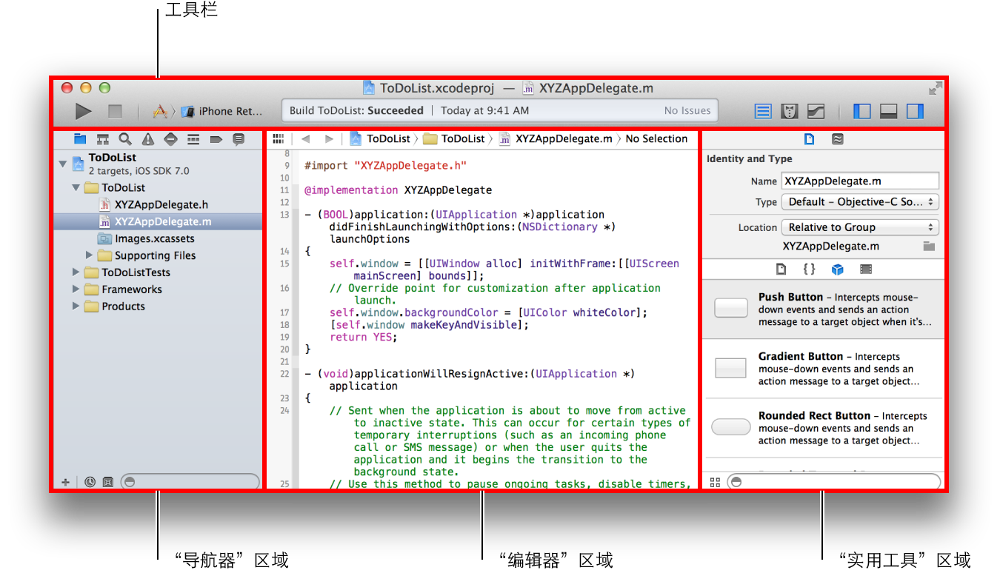
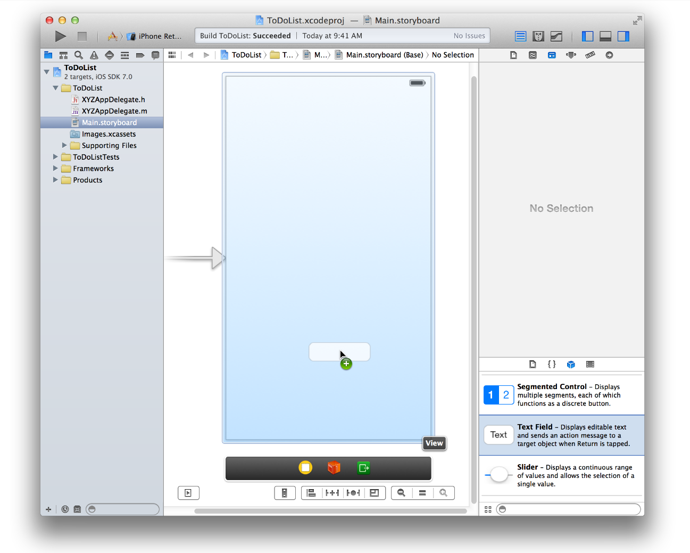

# 基础

本教程描述了什么是应用程序、创建简单用户界面的过程，以及如何添加自定行为，将界面转变成可运行的应用程序。

遵循本教程，可了解 iOS 应用程序开发的基础内容，包括：

- 如何使用 Xcode 来创建和管理项目
- 如何识别 Xcode 项目的关键部分
- 如何将标准用户界面元素添加到应用程序
- 如何构建和运行应用程序

完成教程后，您会得到类似于下图的应用程序：


开发 iPad 应用程序的工具和技术与 iPhone 完全相同。为简单起见，本教程只针对 iPhone。教程使用 Xcode 5.0 和 iOS SDK 7.0。

## 创建新项目

要开发应用程序，首先请创建一个新的 Xcode 项目。

Xcode 随附了几个内建应用程序模板，可用于开发常见的 iOS 应用程序，如游戏、基于标签浏览的应用程序和基于表格视图的应用程序。这些模板大都预先配置了界面和源代码文件，可作为您进行开发工作的起点。本教程会从最基础的模板开始：Empty Application。

使用 Empty Application 模板有助于理解 iOS 应用程序的基本结构，以及如何将内容呈现给用户。了解完所有组件的工作方式后，您可以将其他模板用在自己的应用程序上，来节省一些配置时间。

### 创建新的空项目

1.从 /Applications 目录打开 Xcode。

Xcode 欢迎窗口会出现。


如果出现的是项目窗口，而不是欢迎窗口，请不要着急；这说明您可能曾在 Xcode 中创建或打开过项目。您只需在接下来的步骤中，使用菜单项来创建项目。

2.在欢迎窗口中，点按“Create a new Xcode project”（或选取“File”>“New”>“Project”）。
Xcode 将打开一个新窗口并显示对话框，让您从中选取一个模板。


3.在对话框左边的 iOS 部分，选择“Application”。

4.在对话框的主区域中，点按“Empty Application”，然后点按“Next”。

5.在出现的对话框中，给应用程序命名并选取应用程序的其他选项。


请使用以下值：

- Product Name：ToDoList
- Xcode 会使用您输入的产品名称给您的项目和应用程序命名。
- Company Identifier：您的公司标识符（如果有）。如果没有，请使用 com.example。
- Class Prefix：XYZ

Xcode 会使用类前缀名称来命名为您创建的类。Objective-C 类的名称必须是代码中唯一的词，并区别于任何可能在框架或捆绑包中使用的词。为使类名称保持唯一性，通常要为所有类添加前缀。Apple 已经为框架类保留了两个字母组成的前缀，所以请使用三个字母或更长的前缀。

6.从“Devices”弹出式菜单中选取“iPhone”。

前文中已经提到，使用 iPhone 界面创建应用程序是最简单的入门方式。为 iPad 创建应用程序或创建通用应用程序的技术与此相同。

7.点按“Next”。

8.在出现的对话框中，选取项目的存放位置，然后点按“Create”。

Xcode 会在工作区窗口中打开新项目，窗口的外观类似：


## 熟悉 Xcode

Xcode 包括了您创建应用程序时所需的一切。它不仅整理了创建应用程序时所需的文件，还提供了代码和界面元素编辑器，可让您构建和运行应用程序，并拥有强大的集成调试程序。

请花几分钟时间来熟悉 Xcode 工作区窗口。在接下来的整个教程中，您将会用到下面窗口中标识出的控制。点按不同的按钮，体验一下它们的工作方式。如果要了解有关界面某个部分的更多信息，请阅读其帮助文章。方法是按住 Control 键点按 Xcode 中的区域，然后从出现的快捷菜单中选取文章。



## 运行 iOS Simulator

由于项目是基于 Xcode 模板创建的，因此基本的应用程序环境已经自动为您设置好了。即使没有编写任何代码，也可以构建和运行 Empty Application 模板，而无需进行任何额外的配置。

构建和运行您的应用程序，可以使用 Xcode 自带的 iOS Simulator 应用程序。顾名思义，iOS Simulator 可模拟在 iOS 设备上运行应用程序，让您初步了解它的外观和行为。

它可模拟多种不同类型的硬件，包括屏幕大小不同的 iPad、iPhone 等等。因此，您可以模拟在任何一款开发目标设备上运行应用程序。在本教程中，我们选择使用“iPhone Retina (4-inch)”。

### 在 iOS Simulator 中运行应用程序

1.从 Xcode 工具栏的“Scheme”弹出式菜单中选取“iPhone Retina (4-inch)”。


继续浏览菜单，查看 iOS Simulator 中的其他硬件选项。

2.点按 Xcode 工具栏左上角的“Run”按钮。


或者，可以选取“Product”>“Run”（或按下 Command-R）。

如果是首次运行应用程序，Xcode 会询问您是否要在 Mac 上启用开发者模式。开发者模式可让 Xcode 访问特定的调试功能，无需每次都输入密码。请决定是否要启用开发者模式，然后按照提示操作。如果选取不启用，可能稍后会要求您输入密码。本教程假定已启用了开发者模式。

3.构建过程完成后，请看 Xcode 工具栏。

Xcode 会在工具栏中间的活动显示窗口中显示有关构建过程的消息。

iOS Simulator 会按照您的指定，以 iPhone 模式打开。在模拟的 iPhone 屏幕上，iOS Simulator 会打开您的应用程序。（如果此时在 Xcode 调试程序中看到一则信息，请不必担心，稍后的教程中会有解释。）


一如其名，Empty Application 模板并未包括过多的代码，仅会显示一个白色的屏幕。其他模板会有更多复杂的行为，因此在扩展模板制作自己的应用程序之前，先要弄清楚模板的用处，这一点很重要。而要做到这一点，一个很好的方式，就是先不做任何修改，直接运行模板。

探索完应用程序后，请选取“iOS Simulator”>“Quit iOS Simulator”（或按下 Command-Q）来退出 iOS Simulator。

## 检查源代码

Empty Application 模板附带了少量现成的源代码，用于设置应用程序环境。大多数工作都由 UIApplicationMain 函数来完成，它在项目的 main.m 源文件中会被自动调用。UIApplicationMain 函数会创建一个应用程序对象来设置应用程序基础结构，以配合 iOS 系统运作。包括创建一个运行循环，将输入事件传递给应用程序。

您不需要直接处理 main.m 源文件，但是了解一下它的工作方式也是颇有趣味的。

### 查看 main.m 源文件

1.请确定项目导航器已在导航器区域中打开。

项目导航器会显示项目中的所有文件。如果项目导航器未打开，请点按导航器选择栏最左边的按钮。


2.点按项目导航器中“Supporting Files”文件夹旁边的显示三角形，打开文件夹。

3.选择 main.m。

Xcode 会在窗口的主编辑器区域打开源文件，外观类似于：


如果连按该文件，它会在单独的窗口中打开。您可以根据需要进行选择：点按文件一次，将其在主项目窗口中打开；或是连按文件，将其在单独的窗口中打开。

main 中的 main.m 函数会调用自动释放池 (autorelease pool) 中的 UIApplicationMain 函数。

```
@autoreleasepool {
   return UIApplicationMain(argc, argv, nil, NSStringFromClass([XYZAppDelegate class]));
}
```

@autoreleasepool 语句支持应用程序的内存管理。自动引用计数 (Automatic Reference Counting, ARC) 利用编译器追踪对象的所有者，使内存管理变得简单；@autoreleasepool 是内存管理基础结构的一部分。

调用 UIApplicationMain 会创建应用程序的两个重要初始组件：

[UIApplication 类的实例](https://developer.apple.com/library/ios/documentation/UIKit/Reference/UIApplication_Class/index.html#//apple_ref/occ/cl/UIApplication)， 称为应用程序对象。

应用程序对象可管理应用程序事件循环，并协调其他高级的应用程序行为。定义在 UIKit 框架中的这个类，不要求您编写任何额外的代码，就可以达成其任务。

XYZAppDelegate 类的实例，称为应用程序委托。

Xcode 创建此类，作为设置 Empty Application 模板的一部分。应用程序委托会创建一个呈现应用程序内容的窗口，并为响应应用程序内的状态转换提供位置。这个窗口是您编写自定应用程序级代码的地方。与所有的类一样，XYZAppDelegate 类在应用程序的两个源代码文件中被定义：接口文件 XYZAppDelegate.h；实现文件 XYZAppDelegate.m。

以下是应用程序对象和应用程序委托互动的方式。应用程序启动时，应用程序对象会调用应用程序委托上已定义的方法，使自定代码有机会执行其操作，这正是运行应用程序的有趣之处。为了深入理解应用程序委托的角色，请从接口文件开始查看其源代码。如果要查看应用程序委托的接口文件，请在项目导航器中选择 XYZAppDelegate.h。应用程序委托的界面包含了单一属性：window。有了这个属性，应用程序委托才会跟踪能呈现所有应用程序内容的窗口。

下一步，请查看应用程序委托的实现文件。请在项目导航器中选择 XYZAppDelegate.m。应用程序委托的实现包含了一些重要方法的“骨架”。这些预定义的方法可让应用程序对象与应用程序委托进行沟通。在一个重要的运行时事件（例如，应用程序启动、低内存警告和应用程序终止）中，应用程序对象会调用应用程序委托中相应的方法，使其有机会进行适当的响应。您无需执行任何特殊的操作，来确定这些方法是否会在正确的时间被调用，因为应用程序对象会帮您处理这部分的工作。

这些自动实现的方法都具有一个默认的行为。就算将骨架实现留空，或将它从 XYZAppDelegate.m 文件中删除，这些行为在方法被调用时，都会默认执行。您可以使用这些骨架来放置附加的自定代码，以在方法被调用时执行。例如，XYZAppDelegate.m 文件中的第一个方法包含了几行代码，用于设置应用程序的窗口，并让应用程序首次运行时显示白色的背景颜色。在本教程中，您不会使用到任何自定应用程序委托代码，因此可以移除这段代码。

### 配置应用程序委托的实现文件

1. 请在 XYZAppDelegate.m 中查找 application:didFinishLaunchingWithOptions: 方法。
它是文件中的第一个方法。

2. 从该方法中删除前三行代码，然后它会显示为：

```
- (BOOL)application:(UIApplication *)application didFinishLaunchingWithOptions:(NSDictionary *)launchOptions
{
    return YES;
}
```

Xcode 会自动存储更改。它会时刻跟踪并存储您的所有操作。（您可以通过选取“Edit”>“Undo Typing”来撤销所作的更改。）

## 创建串联图

现在，您应该已经准备好创建应用程序的串联图了。串联图能直观展示应用程序的用户界面、显示内容屏幕以及它们之间的转换。您可以使用串联图对驱动应用程序的流程或构思进行布局。

要了解串联图融入应用程序的方法，在本教程中您可以手动创建一个，然后将其添加到应用程序内。与开始使用的 Empty Application 模板不同，其他 Xcode 模板包含了预配置的串联图，提供了视图、视图控制器和相关的源文件，用于设置该类型的应用程序的基本架构。手动配置完串联图后，您将会看到各个部分是如何配合工作的。然后，您就可以使用预配置有串联图的项目模板，开始应用程序开发了，这会节省不少时间。

### 创建新的串联图

- 选取“File”>“New”>“File”（或按下 Command-N）。
- 这时将会出现一个对话框，提示您为新文件选取模板。
- 在左边，选择 iOS 下方的“User Interface”。
- 点按“Storyboard”，然后点按“Next”。
- 在“Devices”选项中，选择“iPhone”。
- 点按“Next”。
- 这时会出现一个对话框，提示您选取一个位置并为新串联图命名。
- 在“Save As”栏中，将文件命名为 Main。
- 请确定将文件与项目存储在同一个目录中。


- 在“Group”选项中，选择“ToDoList”。
- 对于“Targets”，选择“ToDoList”旁边的复选框。
 此选项可让 Xcode 在构建应用程序时包括新的串联图。
- 点按“Create”。

这时，一个新的串联图文件将创建完成，并被添加到项目中。您可以在这个文件中工作，对应用程序的内容进行布局。

现在，需要让 Xcode 知道您想将此串联图用作应用程序中的界面。开始时，应用程序对象会检查该应用程序是否配置了主界面。如果已配置，应用程序对象会在应用程序启动时载入已定义的串联图。

### 将串联图设为应用程序的主界面

1.在项目导航器中，选择您的项目。

在工作区窗口的编辑器区域，Xcode 会显示项目编辑器，可让您查看和编辑与应用程序构建有关的细节。

2.在“Targets”的下方，选择“ToDoList”。


如果“Project”和“Targets”列表未显示在项目编辑器中，请点按编辑器面板左上角的显示三角形。


3.选择“General”标签。

4.在“Deployment Info”的下方，找到“Main Interface”选项。

5.选择您的串联图：Main.storyboard。

## 将场景添加到串联图中

现在，串联图已经创建完成，接下来让我们开始添加应用程序的内容吧。Xcode 提供了对象库，您可以将库中的对象添加到串联图文件。其中的一些对象属于视图中的用户界面元素，例如按钮和文本栏。其他的对象则定义了应用程序的行为，但它们不会显示在屏幕上，如视图控制器和手势识别器。

首先，请将视图控制器添加到串联图中。视图控制器管理了相应的视图及其分视图。在下一章，“[App Development Process](app-development-process.md)”中，您将会了解到有关视图角色和视图控制器的更多信息。

### 将视图控制器添加到串联图

1.在项目导航器中，选择 Main.storyboard。

Xcode 会在编辑器区域的 Interface Builder（其可视化界面编辑器）中打开串联图。由于串联图是空的，因此您看到的是空白画布。画布可用来添加和排列用户界面的元素。

2.打开对象库。

对象库出现在实用工具区域的底部。如果看不到对象库，您可以点按其按钮，即库选择栏中左起第三个按钮。（如果看不到实用工具区域，可以选取“View”>“Utilities”>“Show Utilities”来显示。）


列表显示每个对象的名称、描述和可视化表示。

3.将“View Controller”对象从列表拖到画布中。

如果在对象库中找不到标题为“View Controller”的对象，请在列表下方的文本栏中键入内容来过滤对象列表。键入 View Controller，那么过滤后的列表中就只会显示视图控制器对象。

现在，应用程序中的串联图包含了一个场景。画布上指向场景左侧的箭头是“initial scene indicator”（初始场景指示器），它表示此场景是应用程序启动时首先载入的场景。现在，您在画布上看到的场景包含了单个视图，由视图控制器管理。虽然是在 iOS Simulator 中运行应用程序，但实际上这也是您将在设备屏幕上看到的视图。在 iOS Simulator 上运行应用程序有助于验证所有配置正确与否。执行该操作前，请在场景中添加一些可以在应用程序运行时看见的内容。

### 将标签添加到场景

1.在对象库中，找到“Label”对象。

如果曾在过滤文本栏中输入过内容，那么需要先清除原有内容，才能看到“Label”对象。您也可以在过滤栏中键入“Label”来快速查找“Label”对象。

2.将“Label”对象从列表拖到场景中。


3.将标签拖到场景的中央，直到出现水平和垂直参考线。

看到以下图标时，停止拖移标签：


参考线表示目前标签已水平和垂直居中。（只有在参考线旁拖移对象或调整其大小时，参考线才可见；因此当您松开标签时，参考线会消失。）

4.连按标签的文本，选中并进行编辑。

5.键入“Hello, World!”并按下 Return 键。

如有需要，请将标签重新居中。

## 测试更改

最好在 iOS Simulator 中运行应用程序进行定期检查，看看是否一切都如预期般正常。此时，当应用程序启动时，应会载入您在主串联图中创建的场景。点按 Xcode 中的“Run”按钮。您看到的应该大致是这样的：


如果看不到添加的标签，请确定所创建的串联图已配置为应用程序的主界面，并确定在应用程序委托中用于创建空白色窗口的代码已移除。如有需要，请返回到前面，并重复相关章节中的步骤。

借此机会，您可以试验一下界面可添加的内容。通过更改以下设置来探索 Interface Builder：

- 标签的文本
- 标签的字体
- 文本的颜色

## 构建基本界面

现在您已经知道如何在场景中添加内容，接下来让我们开始构建场景的基本界面，将新项目添加到待办事项列表中。

将项目添加到待办事项列表需要一则信息：项目名称。您可以从文本栏中获得此信息。文本栏是界面元素，可让用户使用键盘输入单行文本。但首先，您需要移除前面所添加的标签。

### 从场景移除标签

1.点按标签进行选择。

2.按下 Delete 键。

该标签会从场景中移除。如果操作与期望不符，可以选取“Edit”>“Undo Delete Label”。（每个编辑器都有可撤销上一个操作的“Edit > Undo”命令。）

现在画布又重新恢复为空白，可创建用于添加待办事项的场景。

### 将文本栏添加到场景

1.如有需要，请打开对象库。

2.将“Text Field”对象从列表拖到场景中。



3.拖移文本栏，然后放置在距屏幕底部三分之二的位置。


4.如有需要，请点按文本栏来显示调整大小控制柄。

通过拖移调整大小控制柄（显示在元素边框上的白色小方块）来调整 UI 元素的大小。您可以选择元素来显示其调整大小控制柄。在本例中，因为您刚刚停止拖移，文本栏应该已被选定。如果文本栏外观如下图所示，就可以调整它的大小；否则请在画布上选择它。


5.调整文本栏的左侧和右侧边缘，直到垂直参考线显示。

当看到画布像下图这样时，停止调整文本栏大小：


虽然场景中已经有了文本栏，但是尚未告知用户应当在栏中输入什么内容。使用文本栏的占位符文本，提示用户输入新待办事项的名称。

### 配置文本栏的占位符文本

1.定文本栏，打开实用工具区域中的“Attributes”检查器 。

选择检查器选择栏中左起第四个按钮时，“Attributes”检查器会出现。它可让您编辑串联图中对象的属性。

。

2.在“Attributes”检查器中，找到标有“Placeholder”的栏，然后键入“New to-do item”。

如果要在文本栏中显示新的占位符文本，请按下 Return 键。

检查点：在 iOS Simulator 中运行应用程序，确定一下所创建的场景是否令您满意。您应该能够在文本栏中点按，而且可以使用键盘输入字符串。


## 小结

现在，您学会了如何使用串联图来创建基本的界面。在接下来的教程中，会了解到如何给界面添加交互，以及如何编写代码来创建自定行为。教程中的各个章节介绍了一些概念，可让您在处理自己的应用程序时学以致用。

