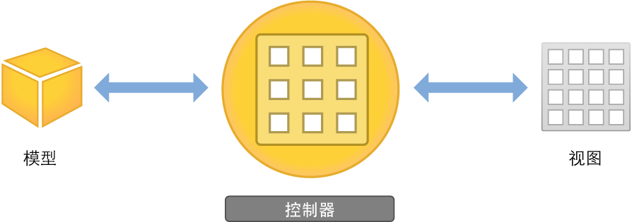
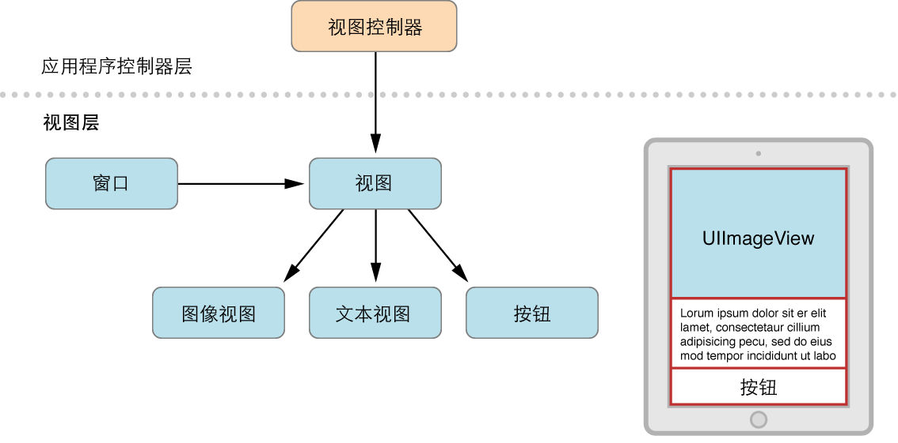
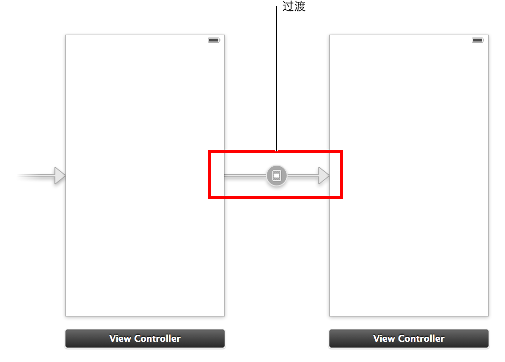

# 定义交互

对用户界面进行布局后，接下来就需要让用户与界面进行交互。这时就要使用控制器了。控制器能响应用户操作并使用内容填充视图，从而支持您的视图。控制器对象是一个管道，通过它，视图能了解数据模型的修改，反之亦然。应用程序的控制器会通知视图有关模型数据中的修改，之后控制器会将用户发起的修改（例如，在文本栏中输入的文本）传达到模型对象。不论模型对象是响应用户操作，还是定义浏览，控制器都会实现应用程序的行为。



## 视图控制器

构建了基本的视图层次后，下一步就需要控制可视元素并响应用户输入。在 iOS 应用程序中，您可以使用视图控制器 (UIViewController) 来管理内容视图及其分视图层次。



视图控制器并不是视图层次的一部分，也不是界面中的元素。相反，它管理着层次中的视图对象，并为它们提供行为。在串联图中构建的每个内容视图层次，都需要一个对应的视图控制器来管理界面元素，并执行任务来响应用户的交互操作。通常，这意味着您需要为每个内容视图层次编写一个自定 UIViewController 子类。如果应用程序有多个内容视图，那么就需要为每个内容视图使用不同的自定视图控制器类。

视图控制器扮演着多种角色。它们负责协调应用程序的数据模型与显示该数据的视图之间的信息传输，管理应用程序的内容视图的生命周期，并处理设备旋转时方向的更改。但其最主要的作用可能是响应用户输入。

您还可以使用视图控制器来转换各种类型的内容。由于 iOS 应用程序显示内容的空间很有限，因此视图控制器提供了所需要的基础结构，可让您移除一个视图控制器的视图，替换为另一个视图控制器中的视图。

通过让视图控制器文件与串联图中的视图进行通信，可以定义应用程序中的交互方式。方法是通过 Action 与 Outlet 来定义串联图与源代码文件之间的连接。

## 操作 (Action)

操作 是一段代码，它与应用程序中可能会发生的某类事件相链接。该事件发生后，代码就会执行。您可以定义操作来完成任何事情：从操控数据到更新用户界面。操作可驱动应用程序的流程来响应用户事件或者系统事件。

可采用如下方法来定义：使用 IBAction 返回类型和 sender 参数来创建并实现方法。

```
- (IBAction)restoreDefaults:(id)sender;
```

sender 参数指向负责触发操作的对象。IBAction 返回类型是个特殊的关键词。它与 void 关键词类似，但它表示该方法是一种操作，您可以在 Interface Builder 的串联图中连接到这种操作（这就是这个关键词有 IB 前缀的原因）。在串联图中，您会了解如何将 IBAction 操作链接到串联图中元素的更多知识。

## Outlet

Outlet 可让您从源代码文件引用界面中的对象（添加到串联图的对象）。您可以按住 Control 键，并将串联图中的特定对象拖移至视图控制器文件来创建 Outlet。这就为视图控制器文件中的对象创建了属性，通过该属性，您可以在运行时通过代码来访问并操控该对象。例如，在第二个教程中，您将为 ToDoList 应用程序中的文本栏创建 Outlet，这样就可以用代码的形式访问文本栏的内容。

Outlet 被定义为 IBOutlet 属性。

```
@property (weak, nonatomic) IBOutlet UITextField *textField;
```

IBOutlet 关键词告诉 Xcode，您可以从 Interface Builder 连接到该属性。在“教程：串联图”中，您会了解有关如何从串联图将 Outlet 连接到源代码的更多知识。

## 控制 (Control)

控制是用户界面对象（例如按钮、滑块或者开关），用户可以操控它们来与内容进行交互、提供输入、在应用程序内导航，以及执行所定义的其他操作。代码可通过控制来接收用户界面的消息。

用户与控制进行交互，会创建控制事件。控制事件表示用户可在控制上使用的各种手势，例如将手指抬离控制、手指拖移到控制上，以及在文本栏中按下。

常见的事件类型有三种：

- 触碰和拖移事件。用户通过触碰或者拖移与控制交互时，发生的就是触碰和拖移事件。触碰事件分几个阶段。例如，当用户初次用手指触碰按钮，就会触发 Touch Down Inside 事件；如果用户手指拖离按钮，则会触发相应的拖移事件。当用户的手指抬离按钮但仍停留按钮边缘的范围内，就会发送 Touch Up Inside。如果用户在抬起手指前，手指已经拖离了按钮（实际上是取消了触碰），就会触发 Touch Up Outside 事件。
- 编辑事件。用户编辑文本栏，发生的是编辑事件。
- 值更改事件。用户对控制进行操控，从而导致控制产生一系列不同的值，发生的是值更改事件。

定义交互时，您应该了解与应用程序中每个控制相关联的操作，然后明确地向用户展示应用程序中控制的作用。

## 导航控制器

如果应用程序有多个内容视图层次，就需要能够在它们之间进行切换。为此，可以使用专门的视图控制器：导航控制器 (UINavigationController)。导航控制器管理在一系列视图控制器中向后和向前切换的操作，例如用户在 iOS 版“邮件”应用程序的电子邮件帐户、收件箱邮件和单封电子邮件之间导航。

我们将由特定导航控制器所管理的一组视图控制器称为其导航栈。导航栈是一组后进先出的自定视图控制器对象。添加到堆栈的第一个项目将变成根视图控制器，永不会从堆栈中弹出。而其他视图控制器可被压入或弹出导航栈。

虽然导航控制器的最主要作用是管理内容视图控制器的显示方式，但它还负责显示自己的自定视图。具体来说，它会显示导航栏（位于屏幕顶部的视图，提供有关用户在导航层次中位置的上下文）。导航栏包含一个返回按钮和其他可以自定的按钮。添加到导航栈的每个视图控制器都会显示这个导航栏。您需要配置导航栏。

一般而言，您不必执行任何操作来将视图控制器弹出导航栈；导航控制器提供的返回按钮会实现该操作。但您需要手动将视图控制器压入堆栈中。可使用串联图来操作。

## 使用串联图来定义导航

到目前为止，您已经学习了使用串联图来创建包含单个屏幕内容的应用程序。接下来，将要了解如何使用它们来定义应用程序中多个场景之间的流程。

在第一个教程中，所使用的串联图只有一个场景。而在大多数应用程序中，串联图是由一系列的场景组成，每个场景表示一个视图控制器及其视图层次。场景则由过渡连接。过渡表示两个视图控制器之间的切换：源视图控制器和目的视图控制器。



您可以创建以下几种类型的过渡：

- Push。Push 过渡将目的视图控制器添加到导航栈。只有当源视图控制器与导航控制器连接时，才可以使用 Push 过渡。
- Modal。简单而言，Modal 过渡就是一个视图控制器以模态方式显示另一个控制器，需要用户在显示的控制器上执行某种操作，然后返回到应用程序的主流程。Modal 视图控制器不会添加到导航栈；相反，它通常被认为是所显示的视图控制器的子视图控制器。显示的视图控制器的作用是关闭它所创建和显示的 Modal 视图控制器。
- Custom。可以通过将 UIStoryboardSegue 子类化来定义自定过渡。
- Unwind。Unwind 过渡通过向后移动一个或多个过渡，让用户返回到视图控制器的当前实例。使用 Unwind 过渡可以实现反向导航。

除了过渡之外，还可以通过关系来连接场景。例如，导航控制器与其根视图控制器之间就存在关系。就此而言，这种关系表示导航控制器包含根视图控制器。

使用串联图规划应用程序的用户界面时，要确定将其中一个视图控制器标记为初始视图控制器，这一点尤为重要。运行时，该视图控制器的内容视图会在应用程序首次启动时显示，且在需要时，您可以从该视图控制器切换到其他视图控制器的内容视图。

现在您已经了解了在串联图中处理视图和视图控制器的基础知识。在下一个教程中，我们就要将这些知识运用到 ToDoList 应用程序的开发中。