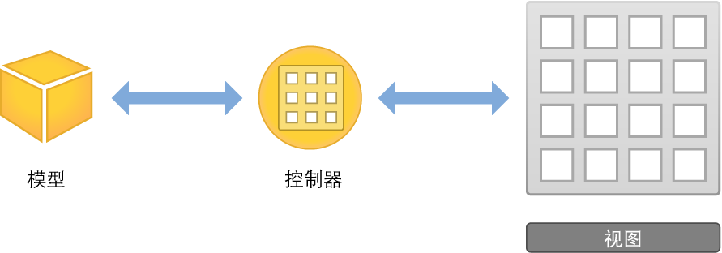
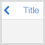
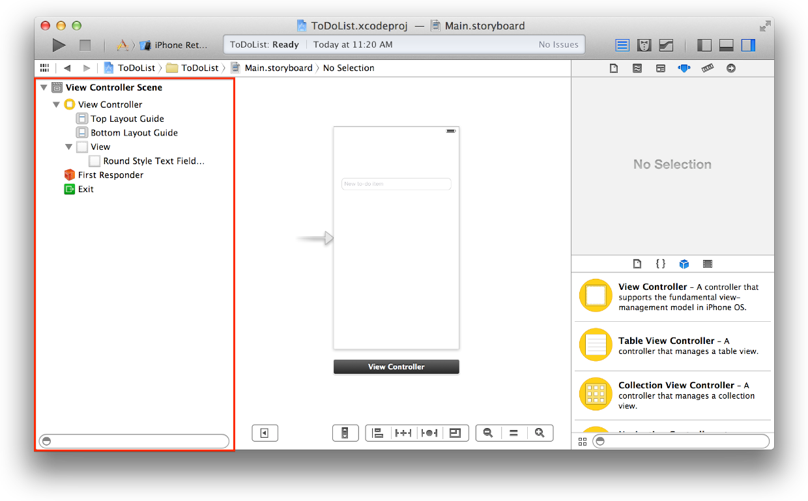
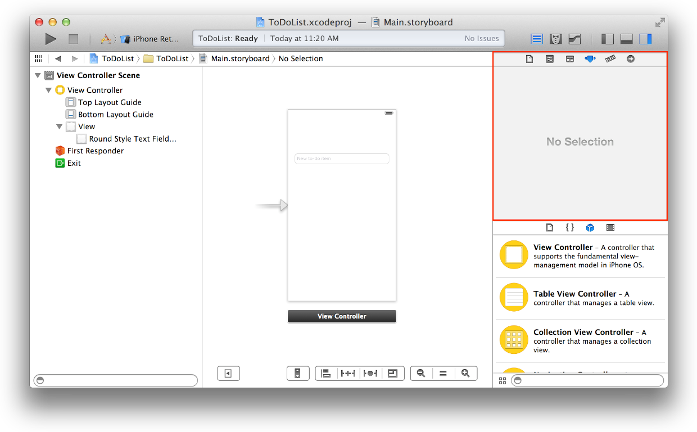
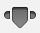
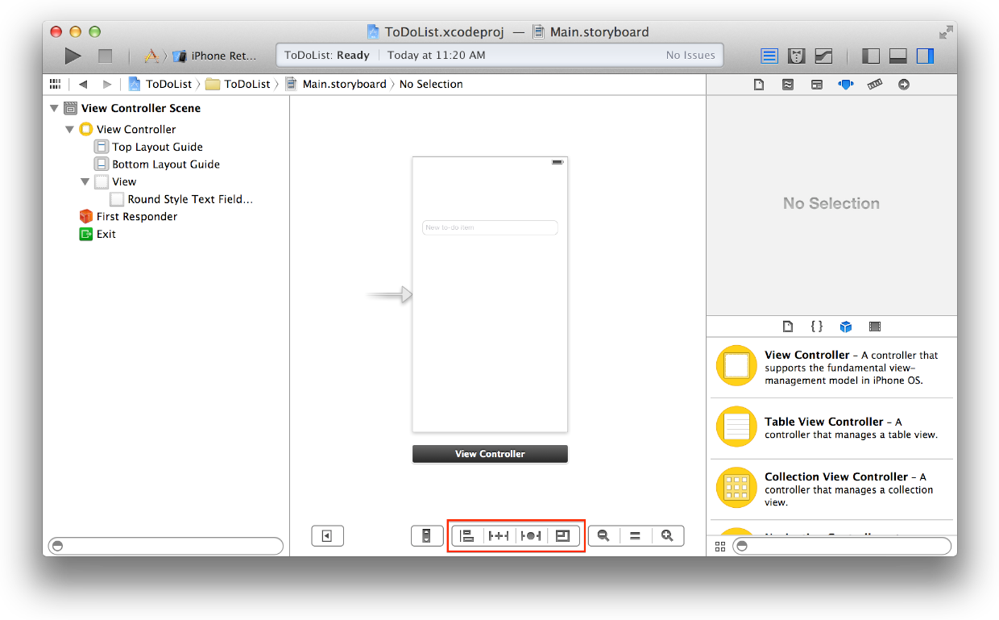

# 设计用户界面

视图是构建用户界面的基石。理解如何使用视图，以优美且实用的方式清晰地呈现您的内容十分重要。想要开发一个成功的应用程序，至关重要的一点便是创建一个优秀的用户界面，有效地展示应用程序的内容。在本章中，您将会学习如何在串联图中创建和管理视图来定义您的界面。

## 视图层次

视图不仅显示在屏幕上并对用户的输入作出响应，它们还可以充当其他视图的容器。因此，应用程序中的视图可按层次结构进行排列，我们将其称为视图层次。视图层次定义了视图相对于其他视图的布局。在该层次内，包含在某个视图中的视图实例称为分视图，而包含视图的父视图则被称为该视图实例的超视图。虽然一个视图实例可以有多个分视图，但它只能有一个超视图。

位于视图层次顶部的是窗口对象。窗口由 UIWindow 类的实例表示，它可以作为基本的容器，您可以将要在屏幕上显示的视图对象添加到其中。窗口本身不会显示任何内容。如果要显示内容，请将内容视图（及其分视图的层次）添加到窗口。

为了让用户看见内容视图及其分视图，必须将内容视图插入到窗口的视图层次中。使用串联图时，系统会自动将内容视图插入到窗口的视图层次中。应用程序对象会载入串联图，创建相关视图控制器类的实例，解压缩每个视图控制器的内容视图层次，然后将初始视图控制器的内容视图添加到窗口中。在下一章中，您会学到有关管理视图控制器的更多内容。目前，您只需专注于在串联图的单个视图控制器中创建层次即可。

## 使用视图构建界面

设计应用程序时，了解将何种视图用于何种目的十分重要。例如，用来收集用户的输入文本的视图（如文本栏）与可能用来显示静态文本的视图（如标签）是不同的。使用 UIKit 视图进行绘图的应用程序很容易创建，因为您可以快速组装一个基本界面。UIKit 视图对象是 UIView 类或其中一个子类的实例。UIKit 框架提供了许多类型的视图，来帮助呈现和组织数据。

每个视图都有其特定的功能，不过 UIKit 大体可分为以下七种常见类型：

|类型 |用途 | 示例|
|:-----------|:-----------|:--------------|
|内容|显示特定类型的内容，例如图像或文本。|图像视图，标签|
|集|显示视图集或视图组。|集视图，表格视图|
|控制|执行操作或显示信息。|按钮，滑块，开关|
|栏|导航或执行操作。|工具栏，导航栏，标签栏|
|输入|接收用户输入的文本。|搜索栏，文本视图|
|容器|充当其他视图的容器。|视图，滚动视图|
|模态|中断应用程序的正常流程，允许用户执行某种操作。|操作表单、提醒视图|

您可以使用 Interface Builder，以图形方式构建视图。Interface Builder 提供了一个资源库，其中包含了标准视图、控制，以及构建界面所需要的其他对象。从资源库拖出这些对象之后，您可以将它们放到画布上，并根据需要进行排列。接着可使用检查器配置这些对象，然后再将它们存储到串联图中。您可以立即看到结果，无需编写代码以及生成并运行应用程序。

可以使用 UIKit 框架提供的标准视图来显示各种类型的内容，但也可以自定义视图，方法是子类化 UIView（或其后代）。自定视图是 UIView 的子类，您可以自行在其中处理所有绘图和事件处理任务。在这些教程中，您将不会使用自定视图，但是在[Defining a Custom View（定义自定视图）中，可以了解到有关实现自定视图的更多知识](https://developer.apple.com/library/ios/documentation/WindowsViews/Conceptual/ViewPG_iPhoneOS/CreatingViews/CreatingViews.html#//apple_ref/doc/uid/TP40009503-CH5-SW23)。

## 使用串联图来布局视图

使用串联图在图形环境中布局视图的层次。您可以使用串联图，以一种直接且直观的方式来处理视图和构建界面。

正如在第一个教程中所学到的，串联图由场景组成，每个场景有关联的视图层次。通过将视图拖出对象库并将其放在串联图场景中，可以自动将它添加到该场景的视图层次。视图在该层次中的位置由您放置的位置决定。将视图添加到场景后，您可以在画布上对其进行大小调整、操控、配置和移动操作。

画布还会显示界面中对象的大纲视图。大纲视图显示在画布的左侧，可让您看到对象在串联图中的层次示意。

在串联图场景中以图形方式创建的视图层次实际上就是 Objective-C 对象的“紧缩”集合。运行时，这些紧缩的对象会被解压缩。运行的结果就是配置了各种属性的相关类（使用实用工具区域中各种检查器以直观方式来设置）的实例层次。

## 使用检查器来配置视图

在串联图中处理视图时，检查器面板是不可或缺的工具。检查器面板显示在对象库上方的实用工具区域中。

每个检查器都提供了配置界面中元素的重要选项。选择串联图中的对象（例如视图）后，可以使用各个检查器来自定义该对象的不同属性。

- File。让您指定串联图的常规信息。
- Quick Help。提供有关对象的实用文稿。
- Identity。让您指定对象的自定类并定义其辅助功能属性。
- Attributes。让您自定对象的可视化属性。
- Size。让您指定对象的大小以及 Auto Layout 属性。
- Connections。让您创建界面和源代码之间的连接。

在第一个教程中，您使用了 Attributes 检查器。而在接下来的整个教程中，您会继续使用这些检查器来配置串联图中的视图和其他对象。特别需要指出的是，您可以使用 Attributes 检查器来配置视图，使用 Identity 检查器来配置视图控制器，使用 Connections 检查器来创建视图和视图控制器之间的连接。

## 使用 Auto Layout 来定位视图

开始在串联图中定位视图时，您需要考虑各种情况。iOS 应用程序会运行在一系列不同的设备上，这些设备的屏幕大小、方向和语言各不相同。您应该设计一个动态而非静态的界面，且该界面能无缝地响应屏幕尺寸、设备方向、本地化语言以及制式的更改。

为了帮助您使用视图来创建通用的界面，Xcode 提供了一种名为 Auto Layout 的工具。Auto Layout 是一种用来表示应用程序的用户界面中各种视图之间关系的体系。它可让您基于单个视图或视图组之间的约束来定义这些关系。

Auto Layout 菜单位于画布的右下角，有四个部分。您可以使用该菜单来各种类型的约束添加到画布上的视图中，解决布局问题以及确定约束调整大小行为。

在第二个教程中，您将短暂地使用 Auto Layout 给 ToDoList 应用程序添加支持横排模式的功能。