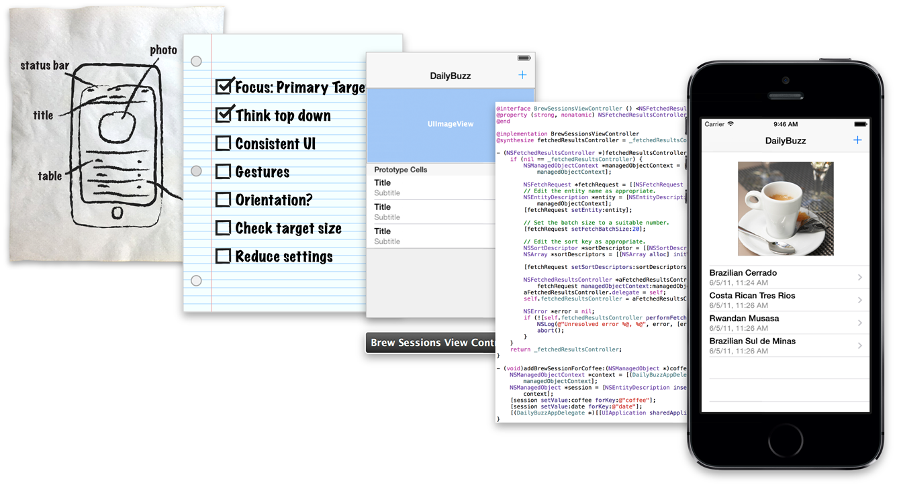

# 应用程序开发过程

开发应用程序看似十分艰巨，其实整个过程可以浓缩为几个易于理解的步骤。下面的步骤可以帮助您立即开始并正确引导您开发第一个应用程序。



## 定义概念

概念是优秀应用程序的源头。

而形成概念的最佳方式便是考虑应用程序所要解决的问题。好的应用程序解决的是单个明确的问题。例如，“设置”应用程序能让用户调整设备上的所有设置。每个任务的相关设置都会在单独界面里完成。

形成概念时，要考虑这些关键的问题：

您的用户是谁？不同应用程序的内容和用户体验大不相同，这取决于您想要编写的是什么应用程序，它可能是儿童游戏，也可能是待办事项列表应用程序，又或者是测试自己学习成果的应用程序。

**应用程序的用途是什么？**赋予应用程序一个明确的用途十分重要。了解激发用户使用应用程序的动因是界定用途的一个出发点。

**应用程序尝试解决什么问题？**应用程序应该完美解决单个问题，而不是尝试解决多个截然不同的问题。如果发现应用程序尝试解决不相关的问题，那么最好考虑编写多个应用程序。

**应用程序要呈现什么内容？**考虑应用程序将向用户呈现的内容类型，以及用户与应用程序的互动方式，然后设计与之相称的用户界面。

刚开始开发应用程序时，不必定义完美或完整的应用程序概念。但有了概念之后，您便会明确自己的开发目标和实现方法。

## 设计用户界面

形成了应用程序的概念后，接下来是设计一个良好的用户界面，这是成功的关键一步。用户需要以尽可能简单的方式与应用程序界面进行交互。为此，您需要从用户的角度来设计界面，使其高效、简洁且直观。

构建用户界面最大的挑战可能在于将概念转化为设计并实现该设计。您可以使用串联图来简化这个过程。串联图能让您使用图形环境来一步设计并实现界面。构建界面时，您可以完全看到构建的内容，马上获得相关界面能否正常工作的反馈，并立即以可视化方式对界面进行更改。

在串联图中构建界面时，您是以视图进行工作。视图向用户显示内容。在“[教程：基础](basis.md)”中，您通过使用串联图场景中的单视图，定义了 ToDoList 应用程序的用户界面。随着应用程序开发的复杂化，您将会创建包含更多场景和视图的界面。

在串联图中，您将使用多种不同的视图来完成构建 ToDoList 应用程序的用户界面，从而显示不同类型的内容。在设计用户界面中，您会了解有关使用视图和串联图来设计和创建用户界面的更多知识。

## 定义交互

没有逻辑的支持，用户界面的功能便会很有限。创建界面后，可以通过编写代码以响应界面中的用户操作来定义用户与他们所看到内容的交互方式。

在考虑为界面添加行为之前，了解 iOS 应用程序是基于事件驱动编程这一点很重要。在事件驱动编程中，应用程序的流程由事件决定：系统事件或用户操作。用户在界面中执行的操作会触发应用程序中的事件。这些事件会促使执行应用程序的逻辑并处理其数据。应用程序对用户操作的响应则会如实地反映在界面中。

请从事件驱动编程的角度来定义用户与界面的交互方式。因为是用户而非开发者控制着何时执行应用程序的某部分代码。您想要确认用户可以执行哪些操作以及如何响应这些操作。

在视图控制器中，您可以定义大多数的事件处理逻辑。在“定义交互”中，会了解有关使用视图控制器的更多知识。之后，在“教程：串联图”中，会应用这些概念，为 ToDoList 应用程序添加功能和交互性。

## 实现行为

定义了用户可以在应用程序中执行的操作后，可以编写代码来实现行为。

为 iOS 应用程序编写代码时，大多数时间都要用到 Objective-C 程序设计语言。在第三个模块中，您会了解有关 Objective-C 的更多知识，但是现在基本熟悉一下 Objective-C 语言的词汇会大有裨益。

Objective-C 源于 C 程序设计语言，它提供了面向对象的功能以及动态运行时。它包含您熟悉的所有元素，例如基本类型（int、float等）、结构、函数、指针以及流程控制结构（while、if...else 以及 for 语句）。您还可以访问标准 C 库例程，例如在 stdlib.h 和 stdio.h 中声明的那些例程。

### 对象是应用程序的基石

构建 iOS 应用程序时，大多数时候接触的是对象。

对象会将具有相关行为的数据包装起来。您可以将应用程序设想为一个大型生态系统，其中互连的对象相互通信来解决特定的问题，例如显示可视化的界面，响应用户的输入或者储存信息。构建应用程序要用到多种不同类型的对象，从界面元素（例如按钮和标签）到数据对象（例如字符串和数组）。

### 类是对象的蓝图

类描述了特定类型的对象所共有的行为和属性。

按照同一个蓝图进行施工的建筑物，它们的结构是相同的。与之类似，类的每个实例的行为和属性与该类的所有其他实例的行为和属性也是相同的。您既可以编写自己的类，也可以使用已经定义好的框架类。

可以通过创建特定类的实例来新建对象。途径是为对象分配并初始化合适的默认值。分配对象时，您为该对象预留了足够的内存并将所有的实例变量设定为 0。初始化将一个对象的初始状态（即它的实例变量和属性）设定为合理的值，然后返回对象。初始化的目的在于返回有用的对象。您需要分配并初始化对象，这样才能使用它。

Objective-C 程序设计语言中的一个基本概念就是类继承，即类会继承父类的行为。一个类继承另一个类时，继承类（或子类）会继承由父类定义的所有行为和属性。您可以为子类定义属于它自己的其他行为和属性或者覆盖父类的行为。这样，您就可以扩展类的行为，而无需复制其现有的行为。

### 对象通过消息通信

对象在运行时通过互相发送消息来交互。在 Objective-C 术语中，一个对象通过调用另一个对象的方法来向该对象发送消息。

在 Objective-C 中，虽然可使用多种方法在对象之间发送消息，但是目前最常用的方法是使用方括号的基本语法。如果您有一个 Person 类的对象 somePerson，那么可以按照如下所述来向它发送消息 sayHello：

```
[somePerson sayHello];
```

左侧的引用 somePerson 是消息的接收者。右侧的消息 sayHello 是调用其方法的名称。换句话说，执行以上代码行时，会向 somePerson 发送 sayHello 消息。


### 协议定义消息发送契约

协议定义对象在给定条件下的一组预期行为。它采用可编程的接口形式（任何类都可以选择来实现）。通过使用协议，两个因为继承而略有关联的类可以彼此通信来完成某个目标，例如解析 XML 代码或拷贝对象。


如果类能够提供为其他类使用的行为，那么该类可以声明可编程的接口，以匿名方式来供应该行为。任何其他类都可以选择采用该协议，并实现该协议的一个或多个方法，从而利用该行为。

## 整合数据

实现应用程序的行为后，您需要创建数据模型来支持应用程序的界面。应用程序的数据模型定义了维护应用程序中数据的方式。数据模型的范围既包括对象的基本词典，也包括复杂的数据库。

应用程序的数据模型应该反映该应用程序的内容和用途。虽然用户不会直接和数据交互，但界面和数据之间应该有明显的相关性。

若要为应用程序打下良好的基石，一个好的数据模型必不可少。有了数据模型，构建可扩展的应用程序、改进功能以及修改特性会变得易如反掌。在整合数据中，您会了解有关定义自己的数据模型的更多知识。

### 使用正确的资源

设计模式是解决应用程序中常见问题的最佳实践。它能帮助您定义数据模型的结构以及它与应用程序其他部分的交互方式。理解并使用正确的设计模式，便能轻松地创建简单且实用的应用程序。在使用设计模式中，您会了解有关设计模式的更多知识。

请记住，刚开始实现模型时，不必一切从零开始。您可以以一系列提供了现有功能的框架为基础进行构建。例如，Foundation 框架包括了表示基本数据类型的类（例如字符串和数字），以及用于储存其他对象的集类。建议您尽可能地使用现有框架类，或者对其进行子类化来为应用程序添加自己的功能，而不是尝试重新实现它们的功能。这样，您就可以创建一个高效、实用且精致的软件。在“[处理 Foundation](foundation.md)”中，您会了解有关 Foundation 框架功能的更多知识。

通常，您会编写自己的自定类来作为数据模型的一部分。通过编写自定类，您可以控制应用程序内部结构的整理方式。在写自定类中，您会了解有关创建自定类的更多知识。

### 整合真实的数据

首次测试数据模型时，您不妨使用静态数据或假数据。这样，在正确组装和连接该模型前，您都无需为提供真实数据而担心了。定义的模型能够正常工作后，再将真实的数据引入应用程序中。

本指南的剩余部分会更详细地介绍这些步骤。随着应用程序开发过程的深入，您将会学习必要的概念性知识，然后在教程中进行实践。


