# 查找信息

开发应用程序时，您会希望先前了解或不了解的信息都随手可查。其实无需离开 Xcode，您便能获得所需的一切信息。

Xcode 附带了大量不同类型的系列文稿，包括通用指南和概念指南、框架和类参考资料，以及重点帮助文章。访问此类文稿的方式多种多样，如按住右键点按 Xcode 的各个区域来了解其使用方式、打开主项目窗口中的“Quick Help”面板来获得上下文相关的代码帮助，或者在“Documentation”窗口中进行搜索来查找指南和完整的 API 参考。

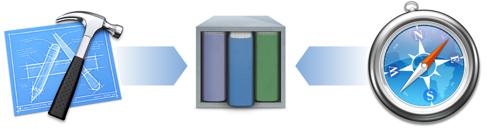

## 通过关联帮助文章来获得 Xcode 指导

若要在使用 Xcode 时获得帮助，请阅读帮助文章。帮助文章会说明如何完成常见的任务，如创建新类、在 Interface Builder 中设置自定类，以及使用 Auto Layout 解决问题。

根据您尝试执行的操作内容，可以按住 Control 键点按 Xcode 中的 UI 元素来访问某些帮助文章。查找关联菜单中上一次输入的内容（此图像中为“Project Navigator Help”）。

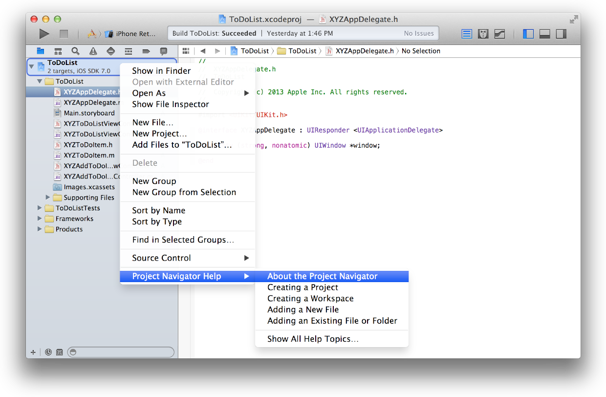

如果查找的是通用帮助，或者任务相关的元素不支持按住 Control 键点按来访问信息，那么您还可以在“Xcode Help”菜单中搜索关联帮助。

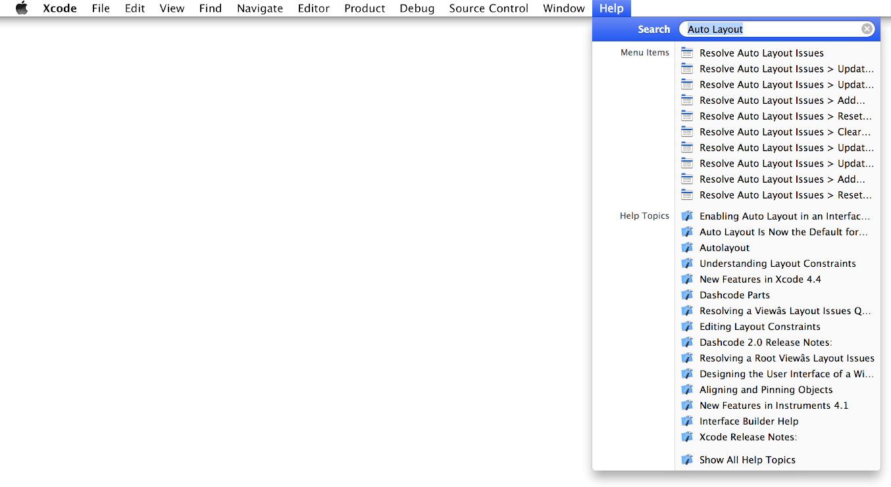

## 使用指南来获得通用概述和概念概述

请阅读概念指南中的相关章节，了解新技术或深入理解框架中不同的类之间配合工作的方式。大多数 Cocoa 框架和技术都有相应的编程指南，如[《SpriteKit Programming Guide》](https://developer.apple.com/library/ios/documentation/GraphicsAnimation/Conceptual/SpriteKit_PG/Introduction/Introduction.html#//apple_ref/doc/uid/TP40013043)（Sprite Kit 编程指南）、[《Programming with Objective-C》](https://developer.apple.com/library/ios/documentation/Cocoa/Conceptual/ProgrammingWithObjectiveC/Introduction/Introduction.html#//apple_ref/doc/uid/TP40011210)（使用 Objective-C 编程），以及[《Location and Maps Programming Guide》](https://developer.apple.com/library/ios/documentation/UserExperience/Conceptual/LocationAwarenessPG/Introduction/Introduction.html#//apple_ref/doc/uid/TP40009497)（位置和地图编程指南）。

在 Xcode 中，可以使用文稿显示窗口来查看此类文稿，访问方法是选取“Help”>“Documentation and API Reference”（Option–Command–问号）。只需键入技术名称即可，如“Sprite Kit”。

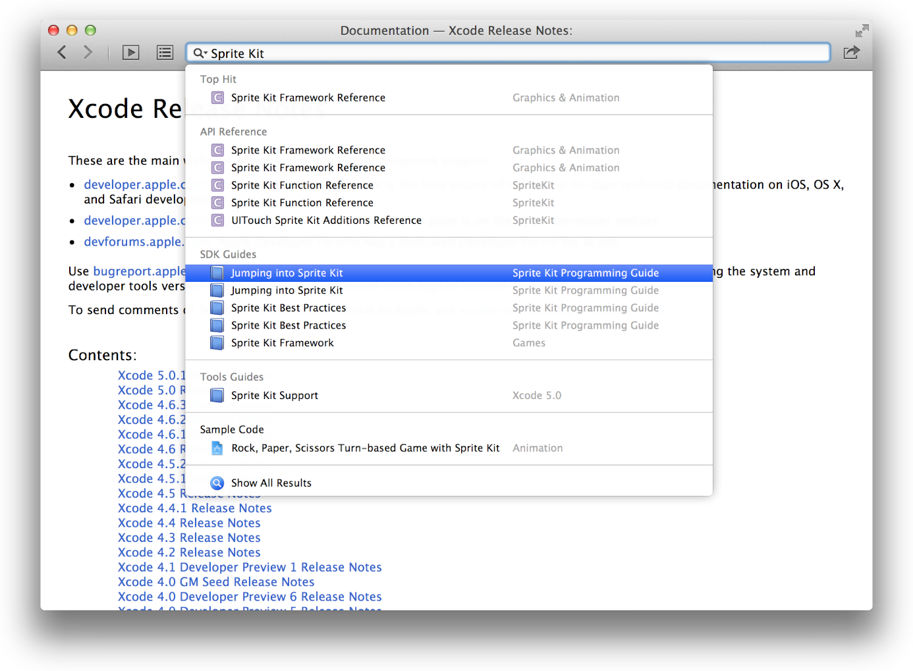

结果将有序显示，对您写代码最有帮助的内容排在前列。也就是说 API 参考条目将首先被列出，接着是 SDK 和“工具”指南。

如果弹出式列表中没有显示合适的结果，请选取“Show All Results”以显示可供过滤的完整结果。

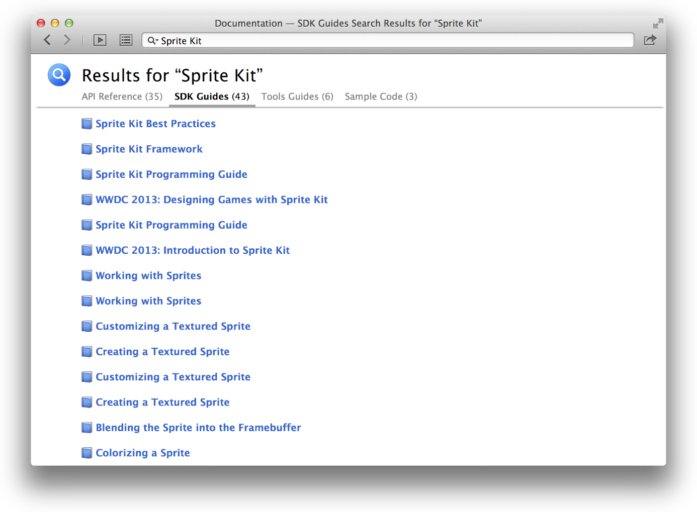

## 使用 API 参考来获得类信息

阅读完指南，了解了技术的方方面面，并开始应用该技术编写代码时，您就会发现还需要进一步了解各个类能做些什么，或者需要掌握如何正确地调用特定方法。API 参考文稿提供了这些信息。

例如，要了解前面教程中使用的 NSString 类的更多信息，只需在文稿显示窗口的搜索栏中键入类的名称即可。

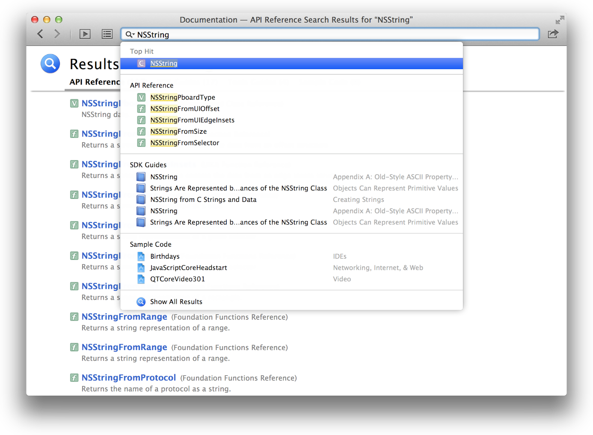

最常点选的内容通常是所需内容；按下 Return 键进行选择，然后就可以看见该类的 API 参考。

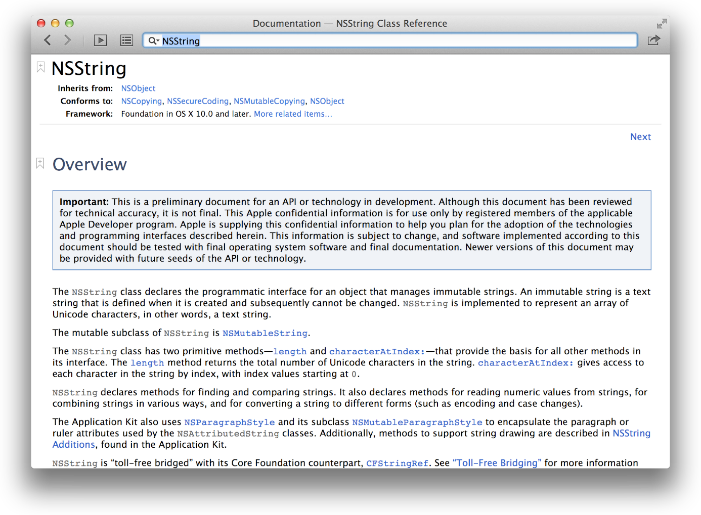

API 参考文稿可让您快速访问各个类的相关信息，包括类所提供的方法列表、父类，以及所采用的协议。点按“More related items”，查看关于类的通用信息。

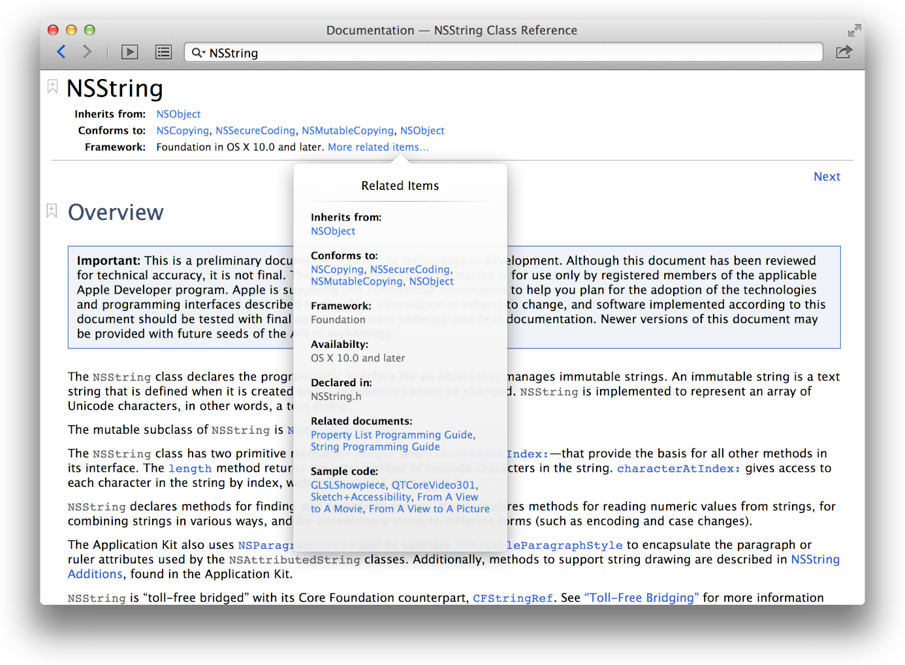

“Related Items”弹出式窗口还会显示相关指南的列表。例如，对于 NSString 来说，如果您更想要了解概念概述，而不是深究参考资料，请阅读[《String Programming Guide》](https://developer.apple.com/library/ios/documentation/Cocoa/Conceptual/Strings/introStrings.html#//apple_ref/doc/uid/10000035i)（String 编程指南）。

除了描述特定的方法或属性之外，API 参考文稿还会概述类可以执行的所有任务。

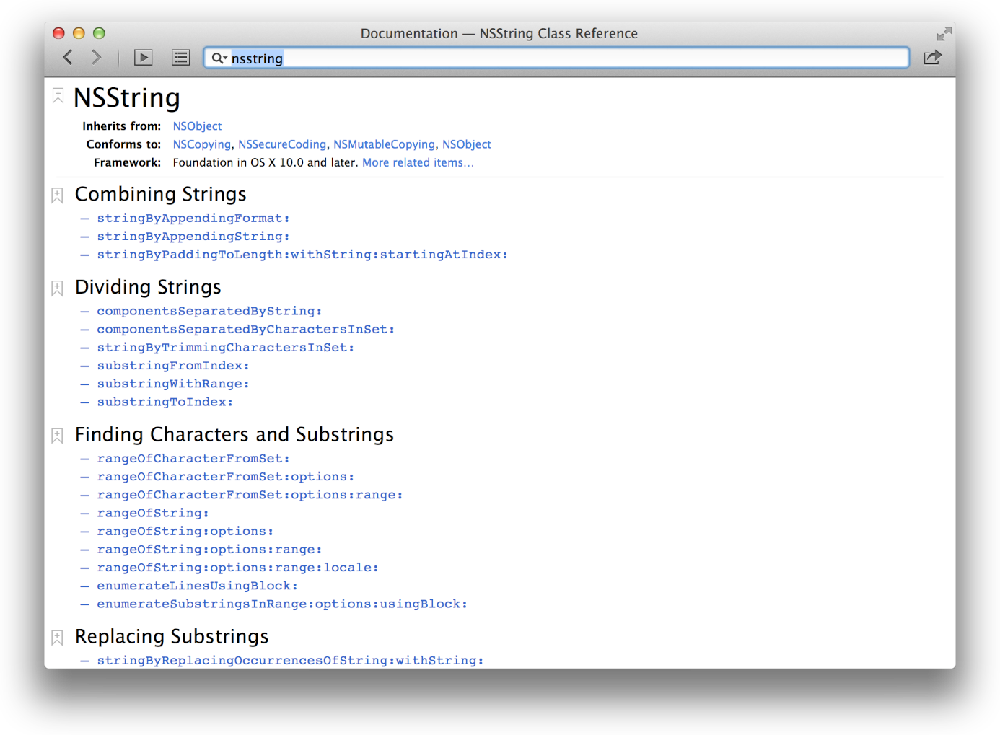

## 使用 Quick Help 来获得关联的源代码信息

在源代码编辑器中写代码时，可在“Quick Help”面板中轻松访问 API 参考文稿（选取“View”>“Utilities”>“Show Quick Help Inspector”）。“Quick Help”面板会在您写代码的过程中不断更新，显示当前正在键入的符号的相关信息。

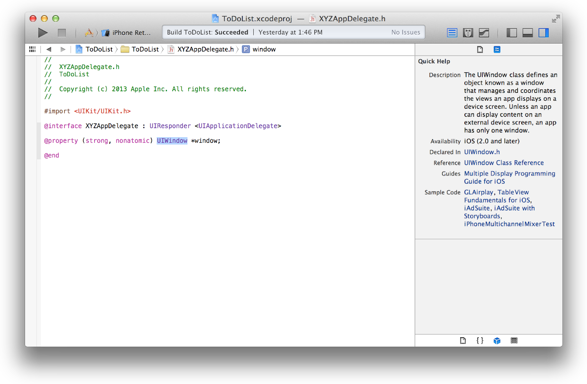

另外，您可以在源代码编辑器中按住 Option 键点按符号，从而显示带有“Quick Help”信息的弹出式窗口。

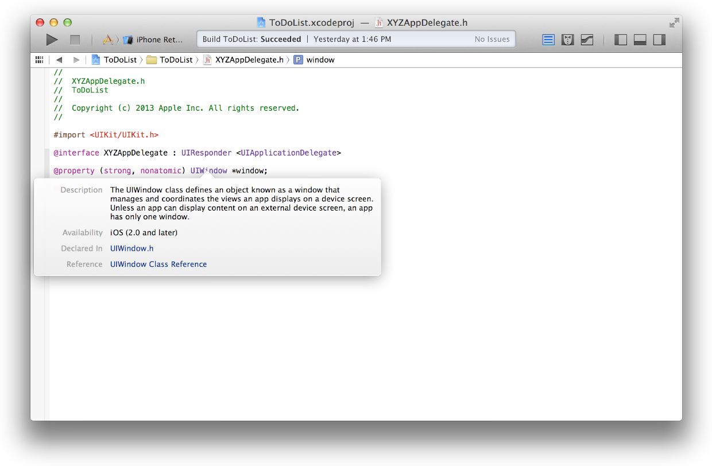

通过“Quick Help”面板或弹出式窗口，您可以在单独的文稿显示窗口中打开 API 参考，还可以查看包含所点按符号的声明的原始头文件。

## 通过示例代码来查看实际用法

除了书面文稿，您还可以访问示例代码资源库。无论何时在文稿显示窗口中阅读快速帮助或指南和参考，都有一些条目会显示给定技术或类的相关示例代码项目。

点按任何一个示例代码条目都可以在 Xcode 中下载并打开项目，以便您检查代码。

除了在整个项目中进行代码注释之外，某些较大的代码示例还有附加文稿。例如，Sprite Kit Adventure 项目附加了[《code:Explained Adventure》](https://developer.apple.com/library/ios/documentation/GraphicsAnimation/Conceptual/CodeExplainedAdventure/AdventureArchitecture/AdventureArchitecture.html#//apple_ref/doc/uid/TP40013140)（代码：解释冒险）文稿。

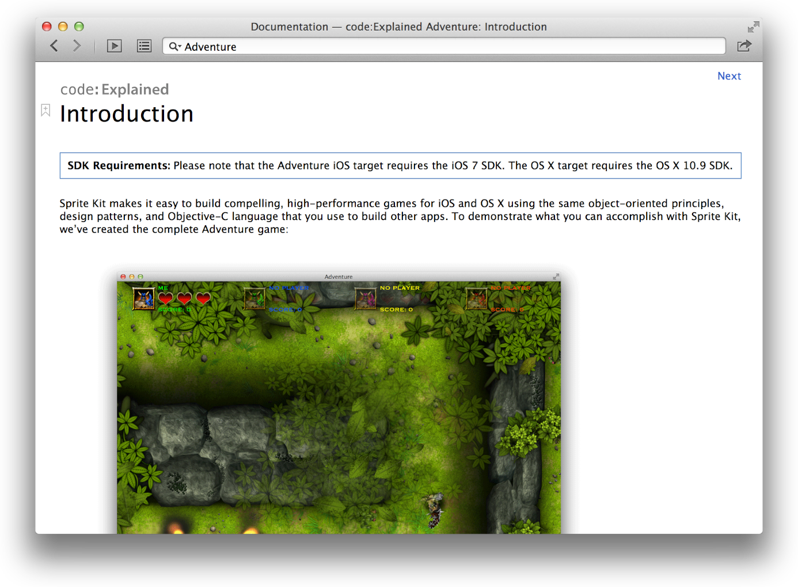

