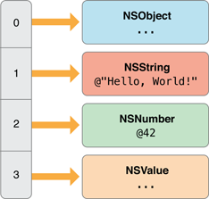

# 处理 Foundation

开始编写应用程序的代码时，可以利用大量的 Objective-C 框架。其中，为所有应用程序提供基本服务的 Foundation 框架尤为重要。Foundation 框架包括表示基本数据类型的值类（如字符串和数字）以及用于储存其他对象的集 (collection) 类。ToDoList 应用程序中的大量代码都可以依靠值类和集类来编写。


## 值对象

Foundation 框架提供了为字符串、二进制数据、日期与时间、数字以及其他值产生值对象的类。

值对象是指封装了基本值（属于 C 数据类型）且提供与该值相关的服务的对象。您会频繁遇到值对象，作为应用程序调用的方法和函数的参数和返回值。框架的不同部分，甚至不同的框架都可以通过传递值对象来交换数据。

以下是 Foundation 框架中值对象的几个示例：

```
NSString 和 NSMutableString
NSData 和 NSMutableData
NSDate
NSNumber
NSValue
```
由于值对象表示标量值，因此您可以在集 (collection) 中使用，也可以在任何需要对象的地方使用。基于值对象所封装的基本类型，它们有一项天然优势：可让您采用简单而高效的方式对封装的值执行某些操作。例如，NSString 类具有用于搜索和替换子字符串、将字符串写入文件或（首选）URL 以及构建文件系统路径的方法。

您可以从基本类型的数据创建值对象（然后在方法参数中传递它）。稍后，您可通过代码从该对象访问被封装的数据。NSNumber 类是这一方法最清晰的示例。

```
int n = 5; // Value assigned to primitive type
NSNumber *numberObject = [NSNumber numberWithInt:n]; // Value object created from primitive type
int y = [numberObject intValue]; // Encapsulated value obtained from value object (y == n)
```

大多数值类会通过声明初始化程序和类工厂方法来创建其实例。类工厂方法由类实施，作为提供给客户的简单方法；它将分配和初始化结合为一个步骤，并返回已创建的对象。例如，NSString 类可声明 string 类方法，以便分配和初始化类的新实例，并将其返回到代码中。

```
NSString *string = [NSString string];
```

除创建值对象和让您访问其封装值之外，大多数值类都提供用于简单操作（如对象比较）的方法

### 字符串

Objective-C 指定字符串的约定与 C 相同：单个字符会使用单引号括起来，而字符串则使用双引号括起来。但是，Objective-C 框架通常不使用 C 字符串。相反，它们会使用 NSString 对象。

NSString 类为字符串提供了一个对象包装器，它具有诸多优势，如内置了可用于储存任意长度字符串的内存管理、提供了对各种字符编码（特别是 Unicode）的支持，以及用于格式化字符串的实用工具等。因为您通常会使用此类字符串，所以 Objective-C 提供了速写记法，即根据常量值来创建 NSString 对象。要使用此 NSString 字面常量，只需在双引号字符串前面添加 (@) 符号，如下例所示：

```
// Create the string "My String" plus carriage return.
NSString *myString = @"My String\n";
// Create the formatted string "1 String".
NSString *anotherString = [NSString stringWithFormat:@"%d %@", 1, @"String"];
// Create an Objective-C string from a C string.
NSString *fromCString = [NSString stringWithCString:"A C string" encoding:NSUTF8StringEncoding];
```

### 数字

Objective-C 提供了创建 NSNumber 对象的速写记法，从而无需调用初始化程序或类工厂方法就可以创建此类对象。只需在数值前面添加 (@) 符号，并选择一个添加在其后面的值类型指示。例如，创建封装整数值和双精度值的 NSNumber 对象，可以编写如下代码：

```
NSNumber *myIntValue    = @32;
NSNumber *myDoubleValue = @3.22346432;
```

您甚至可以使用 NSNumber 字面常量来创建封装的 Boolean 值和字符值。

```
NSNumber *myBoolValue = @YES;
NSNumber *myCharValue = @'V';
```

可以创建 NSNumber 对象，表示无符号整型 (unsigned integers)、长整型 (long integers)、长长整型 (long long integers) 和浮点值 (float values)，方法是将字符“U”、“L”、“LL”和“F”分别追加到记号值末尾。例如，创建封装浮点值的 NSNumber 对象，可以编写如下代码：

```
NSNumber *myFloatValue = @3.2F
```

## 集对象

Objective-C 代码中的大多数集对象都是一种基础集类（NSArray、NSSet 和 NSDictionary）的实例。这些类用于管理对象组，因此要添加到集 (collection) 中的任何项目都必须是 Objective-C 类的实例。如果要添加标量值，就必须先创建合适的 NSNumber 或 NSValue 实例来表示它。

添加进集的任何对象的生命周期都将不短于集。因为集类会使用强引用来跟踪其内容。除了跟踪其内容之外，每个集类都便于您执行特定的任务，如枚举、访问特定项目或是找出特殊的对象是否属于集的一部分。

NSArray、NSSet 和 NSDictionary 类的内容在创建时就应设定。因为它们不能随时间而变化，所以被称为不可变。每个类还有一个可变的子类，允许您随意添加或移除对象。不同类型的集采用不同的方式组织它们所包含的对象：

- NSArray 和 NSMutableArray—数组，包含有序的对象集。通过在数组中指定对象的位置（即索引）来访问对象。数组中首个元素的索引是 0（零）。
- NSSet 和 NSMutableSet—集合，储存无序的对象集，其中每个对象仅出现一次。一般是将测试或过滤器应用到集合中的对象，来访问这些集合中的对象。
- NSDictionary 和 NSMutableDictionary—字典，其条目储存为键－值对；键是唯一的标识符，通常为字符串，而值则是您要储存的对象。通过指定键，您可以访问该对象。

### 数组

数组 (NSArray) 用于表示有序的对象列表。只要求每个项目都是 Objective-C 对象；不要求每个对象都是同一个类的实例。

如果要保持数组中的顺序，每个元素都应储存在从 0 开始的索引中。



### 创建数组

与本章前文所述的值类一样，您可以通过分配和初始化、类工厂方法或数组字面常量来创建数组。

根据对象数量的不同，可用的初始化和工厂方法也多种多样。

```
+ (id)arrayWithObject:(id)anObject;
+ (id)arrayWithObjects:(id)firstObject, ...;
- (id)initWithObjects:(id)firstObject, ...;
```

由于 arrayWithObjects: 和 initWithObjects: 方法都采用了以 nil 结束且数量可变的参数，所以您必须包括 nil 并将其作为最后一个值。

```
NSArray *someArray =
[NSArray arrayWithObjects:someObject, someString, someNumber, someValue, nil];
```
此示例会创建一个如上文所示的数组。第一个对象 someObject 的数组索引为 0；最后一个对象 someValue 的索引则为 3。

如果所提供的其中一个值为 nil ，则有可能使项目列表意外截断。

```
id firstObject = @"someString";
id secondObject = nil;
id thirdObject = @"anotherString";
NSArray *someArray =
  [NSArray arrayWithObjects:firstObject, secondObject, thirdObject, nil];
```

在这种情况下，someArray 只会包含 firstObject，因为 secondObject（即 nil）会被解析为项目列表的末尾。

使用紧凑语法创建数组字面常量也是有可能的。

```
NSArray *someArray = @[firstObject, secondObject, thirdObject];
```

使用此语法时，请勿使用 nil 来结束对象列表；实际上，nil 是无效值。例如，如果您尝试执行以下代码，那么会在运行时中捕获到一个异常：

```
id firstObject = @"someString";
id secondObject = nil;
NSArray *someArray = @[firstObject, secondObject];
// exception: "attempt to insert nil object"
```

### 查询数组对象

创建数组后，可以通过查询来获得信息，如其中有多少个对象，或者其中是否包含给定的项目。

```
NSUInteger numberOfItems = [someArray count];
 
if ([someArray containsObject:someString]) {
    ...
}
```

还可以按照给定索引查询数组来找到项目。如果请求的索引无效，那么会在运行时中获得越界异常。为了避免得到异常，应始终首先检查项目的数量。

```
if ([someArray count] > 0) {
    NSLog(@"First item is: %@", [someArray objectAtIndex:0]);
}
```

此示例用于检查项目的数量是否大于 0。如果数量大于 0，Foundation 函数 NSLog 会记录第一个项目（索引为 0）的描述。

除了使用 objectAtIndex: 之外，还可以使用下标语法来查询数组，就像在标准的 C 数组中访问值一样。上一个示例可被重写为：

```
if ([someArray count] > 0) {
    NSLog(@"First item is: %@", someArray[0]);
}
```

### 排序数组对象

NSArray 类提供了多种方法对其收集的对象进行排序。由于 NSArray 是不可变的，因此这类方法都会返回新的数组，并在其中包含排好序的项目。

例如，您可以通过在每个字符串上调用 compare:，对字符串数组进行排序。

```
NSArray *unsortedStrings = @[@"gammaString", @"alphaString", @"betaString"];
NSArray *sortedStrings =
         [unsortedStrings sortedArrayUsingSelector:@selector(compare:)];
```

### 可变性

虽然 NSArray 类本身不可变，但它仍可包含可变对象。例如，如果将可变字符串添加到不可变的数组，如下所示：

```
NSMutableString *mutableString = [NSMutableString stringWithString:@"Hello"];
NSArray *immutableArray = @[mutableString];
```

就可让您变异该字符串。

```
if ([immutableArray count] > 0) {
    id string = immutableArray[0];
    if ([string isKindOfClass:[NSMutableString class]]) {
        [string appendString:@" World!"];
    }
}
```

如果要在初始创建数组后添加或移除对象，可使用 NSMutableArray，它提供了很多方法来添加、移除或替换一个或多个对象。

```
NSMutableArray *mutableArray = [NSMutableArray array];
[mutableArray addObject:@"gamma"];
[mutableArray addObject:@"alpha"];
[mutableArray addObject:@"beta"];
 
[mutableArray replaceObjectAtIndex:0 withObject:@"epsilon"];
```

此示例创建了由对象 @"epsilon"、@"alpha" 和 @"beta" 构成的数组。

还可以对可变数组进行适当排序，而无需创建二级数组。

```
[mutableArray sortUsingSelector:@selector(caseInsensitiveCompare:)];
```

在这种情况下，包含在内的项目会按升序且不区分大小写的顺序排列（@"alpha"、@"beta" 和 @"epsilon"）。

### 集合

集合 (NSSet) 对象与数组类似，只是其中包含的是各种无序的对象。


因为集合不包含顺序，所以测试成员资格时，集合比数组更快。

由于基础 NSSet 类是不可变的，因此在创建时就必须指定其内容，其中可使用分配和初始化或者类工厂方法。

```
NSSet *simpleSet =
  [NSSet setWithObjects:@"Hello, World!", @42, aValue, anObject, nil];
```

如同 NSArray，initWithObjects: 和 setWithObjects: 方法都采用了以 nil 结束且数量不固定的参数。可变的 NSSet 子类名称是 NSMutableSet。

即使您多次尝试添加对象，集合也只会储存对单个对象的一次引用。

```
    NSNumber *number = @42;
    NSSet *numberSet =
      [NSSet setWithObjects:number, number, number, number, nil];
    // numberSet only contains one object
```

## 字典

与简单汇集有序或无序的对象集不同，字典 (NSDictionary) 会储存与给定键相关的对象，用于以后的检索。

最佳实践是将字符串对象用作字典键。


虽然其他对象也可以用作键，但要注意，每个键都会被拷贝以供字典使用，并且必须支持 NSCopying。不过，如果要使用键－值编码，则必须为字典对象使用字符串键。若要了解更多信息，请参阅[《Key-Value Coding Programming Guide》](https://developer.apple.com/library/ios/documentation/Cocoa/Conceptual/KeyValueCoding/Articles/KeyValueCoding.html#//apple_ref/doc/uid/10000107i)（键值编码编程指南）。

### 创建字典

您可以使用分配、初始化，或者类工厂方法来创建字典，如下所示：

```
NSDictionary *dictionary = [NSDictionary dictionaryWithObjectsAndKeys:
               someObject, @"anObject",
         @"Hello, World!", @"helloString",
                      @42, @"magicNumber",
                someValue, @"aValue",
                      nil];
```

对于 dictionaryWithObjectsAndKeys: 和 initWithObjectsAndKeys: 方法，每个对象都会在其键前进行声明，并且对象列表和键必须以 nil 结束。

Objective-C 提供了一种简洁的语法来创建字典字面常量。

```
NSDictionary *dictionary = @{
              @"anObject" : someObject,
           @"helloString" : @"Hello, World!",
           @"magicNumber" : @42,
                @"aValue" : someValue
};
```

对于字典字面常量，键会在其对象前被指定，并且对象列表和键不以 nil 结束。

### 查询字典

创建字典后，您可以查询储存在给定键中的对象。

```
NSNumber *storedNumber = [dictionary objectForKey:@"magicNumber"];
```

如果找不到该对象，objectForKey: 方法会返回 nil。

同样也可以用下标语法来替代 objectForKey:。

```
NSNumber *storedNumber = dictionary[@"magicNumber"];
```

### 可变性

创建字典后，如果需要添加或移除对象，可使用 NSMutableDictionary 子类。

```
[dictionary setObject:@"another string" forKey:@"secondString"];
[dictionary removeObjectForKey:@"anObject"];
```

### 使用 NSNull 表示 nil

因为在 Objective-C 中，nil 表示“无对象”。因此不可能将 nil 添加到此节所描述的集类中。如果要在集 (collection) 中表示“无对象”，应使用 NSNull 类。

```
NSArray *array = @[ @"string", @42, [NSNull null] ];
```

使用 NSNull，null 方法始终都会返回相同的实例。按此方式工作的类称为单例类。您可以按如下所示的方法来检查数组中的对象是否等于已共享的 NSNull 实例：

```
for (id object in array) {
    if (object == [NSNull null]) {
        NSLog(@"Found a null object");
    }
}
```

虽然 Foundation 框架包含的功能比文中所述要丰富的多，但也不需要您立即了解每一处细节。如果确实想更深入学习 Foundation，可以参阅[《Foundation Framework Reference》](https://developer.apple.com/library/ios/documentation/Cocoa/Reference/Foundation/ObjC_classic/index.html#//apple_ref/doc/uid/20001091)（Foundation 框架参考）。现在，您已经掌握了足够的信息来继续完成 ToDoList 应用程序了，那么就从编写自定数据类开始吧。


