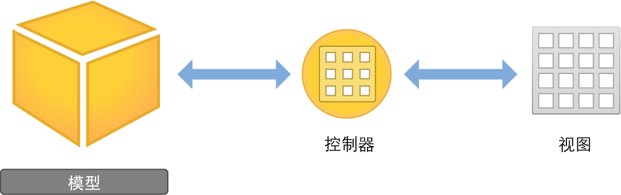

# 整合数据

应用程序的数据模型由数据结构和（可选）自定业务逻辑组成；自定业务逻辑是让数据保持一致状态所必要的。在设计数据模型时，不应完全忽略应用程序的用户界面。但是，您肯定会想单独实现数据模型对象，而不依赖于特定的视图或视图控制器是否存在。保持数据与用户界面分开，有助于通用应用程序（可在 iPad 和 iPhone 双平台上运行的应用程序）的实现，也让代码复用变得更容易。

## 模型设计

如果需要储存的数据很小，那么 Foundation 框架类可能是您的最佳选择。您可以搜索现有的 Foundation 类，查看您可以使用哪些行为，而无需自己尝试实施同样的事情。例如，如果应用程序只需要跟踪字符串列表，则可以依赖 NSArray 和 NSString 来替您操作。在处理 Foundation中，您可以了解有关这些以及其他 Foundation 类的更多信息。

如果数据模型不仅要储存数据，还要求自定业务逻辑，那么您可以编写一个自定类。您应考虑如何将现有框架类合并到您自己的类的实现中。在自定类中使用现有框架类,往往比重写更省时省力。例如，自定类可能使用 NSMutableArray 来储存信息，但是会定义其自己的功能来处理该信息。

以下是设计数据模型时需要注意的一些问题：

您需要储存哪种类型的数据？您设计的数据模型应当能恰当地处理特定类型的内容，不管是储存文本、文稿、大图像，还是其他类型的信息。

您可以使用哪种数据结构？决定了什么地方应该使用框架类，什么地方需要定义具有自定功能的类。

您如何将数据提供给用户界面？您的模型不应该直接与界面通信。如果要处理模型与界面之间的互动，需要为您的控制器添加逻辑。

## 模型实现

您需要了解更多有关 Objective-C 及其功能的信息，才能编写出优秀且高效的代码。虽然本指南描述了如何构建简单的应用程序，但在您自行编写具备完整功能的应用程序前，还需要更加熟悉该语言。

学习 Objective-C 的好方法有很多种。有的人通过阅读《Programming with Objective-C》（使用 Objective-C 编程）来了解其概念，然后编写一些小的测试应用程序来巩固对该语言的理解，并练习编写更好的代码。

有的人则直接跳到编程阶段，并在无法完成某些操作时，再去查找更多信息。如果您更喜欢这种方式，请将《Programming with Objective-C》（使用 Objective-C 编程）留作参考，当作了解各种概念的练习资料，并在开发时应用到应用程序中。

开发您的首个数据模型时，最重要的目标是使它能正常运作。仔细思考数据模型的结构，而不要急于将其完美化。开始实现它之后，则要勇于反复重做和改进您的模型。