# 串联图

本教程以您在首个教程（[“教程：基础”](basis.md)）中创建的项目为基础。您将会实践已学到的知识，包括视图、视图控制器、操作和导航方法。按照界面优先的设计流程，您还将为 ToDoList 应用程序创建某些关键的用户界面，并将行为添加到所创建的场景中。

本教程将向您讲述如何：

- 采用“Auto Layout”为用户界面增添灵活性
- 使用串联图来定义应用程序内容和流程
- 管理多个视图控制器
- 给用户界面中的元素添加操作

完成本教程中的所有步骤后，您的应用程序外观大致是这样的：

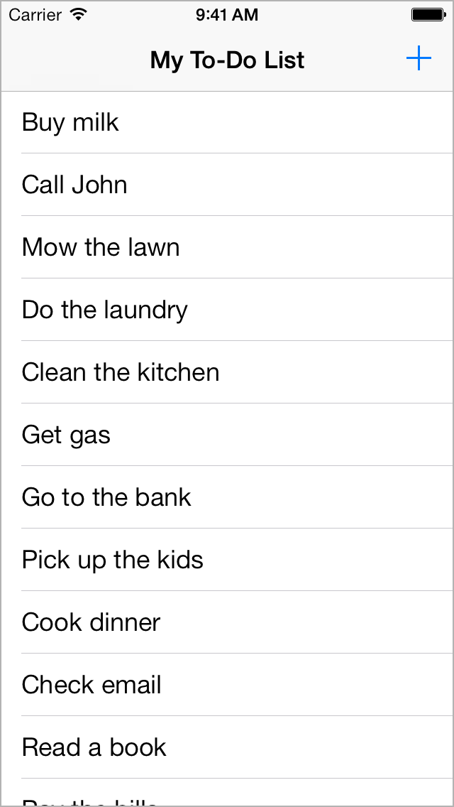

## 采用 Auto Layout

“add-to-do-item”场景的工作模式为竖排，与创建时一致。要是用户旋转了设备会如何？请试着在 Simulator 中运行应用程序来模拟这种情况。

### 在 iOS Simulator 中进行旋转

1.请在 iOS Simulator 中启动应用程序。

2.选取“Hardware”>“Rotate Left”（或按下 Command–左箭头键）。


如您所见，文本栏看起来不大对劲。它只占了屏幕约一半的位置。文本栏本应延伸至整个屏幕，正如竖排模式中显示的那样。幸好，Xcode 内建有一款功能强劲的布局引擎，称为“Auto Layout”。关于场景中要如何放置元素，您可以通过 Auto Layout 将您的意图描述出来，然后由该布局引擎确定如何以最优方案实现该意图。使用约束规则描述您的意图，它说明了应当如何放置一个元素以与另一个元素相关联、元素应有的大小，或者在适用的空间减小时，两个元素中的哪一个应当先缩小。对于“add-to-do-item”场景，则需要使用两类约束：一种用于放置文本栏，另一种用于设定其大小。

这些约束的设定工作均可在 Interface Builder 中轻松完成。

### 使用 Auto Layout 放置文本栏

1.在项目导航器中，选择 Main.storyboard。

2.在串联图中，选择文本栏。

3.在画布上，按住 Control 键从文本栏拖向场景顶部，直到文本栏四周皆为空白区域。此区域为文本栏的父视图。

停止拖移操作时，其位置将出现一个快捷菜单。

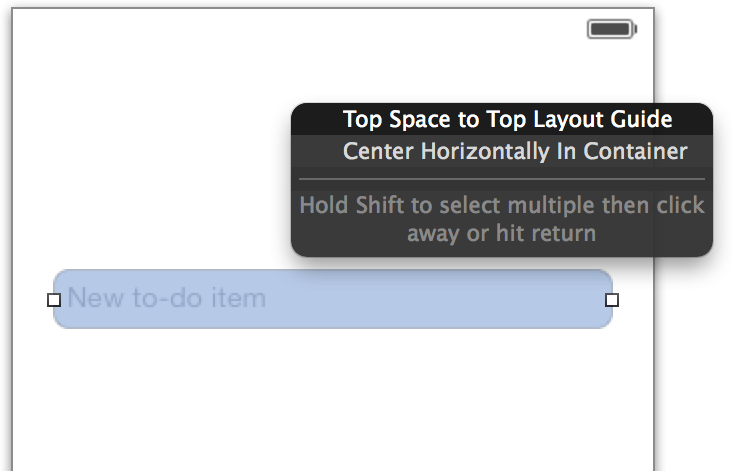

4.从快捷菜单中选取“Top Space to Top Layout Guide”。

在文本栏顶部和导航栏之间，将创建一个间距约束。

如果出现了其他菜单（比如带有“Leading Space to Container”菜单项），则表示您没有垂直地拖到屏幕顶部。Xcode 会根据您拖移的方向来判断您打算生成哪一类约束，并根据拖移的起始点和结束点来判断约束要关联哪些对象。您可以继续尝试不同的拖移方向，以便了解有哪些约束可用。

5.尝试完之后，请按住 Control 键从文本栏向右拖移到父视图，以便创建“Trailing Space to Container”约束。

6.按住 Control 键从文本栏向左拖移到其父视图，以便创建“Leading Space to Container”约束。

这些约束指定了文本栏边缘与其父视图之间的距离，使它们不发生变化。也就是说，如果设备方向发生改变，文本栏将自动伸展以满足这些约束。

检查点：运行您的应用程序。如果您旋转设备，文本栏将根据设备的方向伸展或收缩到适当大小。

如果行为没能达到预期，请启用 Xcode Auto Layout 调试功能以获取帮助。文本栏选定后，请选取“Editor”>“Resolve Auto Layout Issues”>“Reset to Suggested Constraints”，让 Xcode 设置上述步骤所描述的约束。或选取“Editor”>“Resolve Auto Layout Issues”>“Clear Constraints”，移除文本视图上的所有约束，然后试着再次按照上述步骤操作。

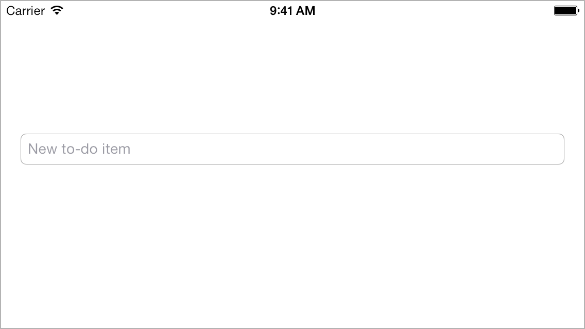

尽管添加项目场景能做的有限，但基本的用户界面都已成型并且初具功能。在一开始考虑清楚布局问题，将为您之后的构建奠定坚实基础。

## 创建第二场景

目前，您已经处理过由视图控制器管理的单个场景，即一个可让您将项目添加到待办事项列表的页面。现在，是时候创建一个能显示整个待办事项列表的场景了。真是幸运，iOS 自带一个名为表格视图的内建类，它功能强大，专门设计用于显示项目的滚动列表。

将带有表格视图的场景添加到串联图

1.在项目导航器中，选择 Main.storyboard。

2.在实用工具区域中打开对象库。（若要通过菜单命令打开资源库，请选取“View”>“Utilities”>“Show Object Library”。）

3.将“Table View Controller”对象从列表中拖出，并放置在“add-to-do-item”场景左侧的画布上。如有需要，您可以使用画布右下方的“缩小”按钮 image: ../Art/zoom_out_2x.png 来获取足够的拖放空间。

如果表格视图中包含内容，但尝试拖到画布时却毫无反应，那么您拖移的很可能是表格视图，而不是表格视图控制器。表格视图是表格视图控制器所管理的多个项目之一，但您需要的是整个套件，因此请找到表格视图控制器，并将其拖到画布。

现在您有了两个场景，一个用于显示待办事项列表，另一个用于添加待办事项。

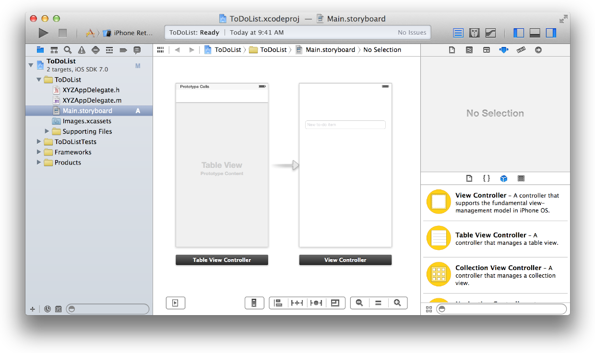

当用户启动应用程序时，让他们先看到列表很有必要。因此请告诉 Xcode 您的意图，把表格视图控制器设置为首个场景。

将表格视图控制器设定为初始场景

- 如有需要，请使用画布左下方的按钮来打开大纲视图 。
- 在大纲视图中，请选择新添加的表格视图控制器。
- 表格视图控制器选定后，请打开实用工具区域中的“Attributes”检查器 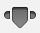。
- 在“Attributes”检查器中，选择“Is Initial View Controller”选项旁的复选框。

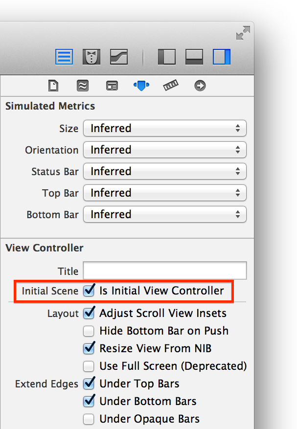

或者，您可以将初始场景指示器从“add-to-do-item”场景中直接拖到画布上的表格视图控制器。
表格视图控制器将设定为串联图中的初始视图控制器，从而成为应用程序启动时载入的首个场景。

检查点：运行您的应用程序。现在，您看到的不是“add-to-do-item”场景及其文本栏，而应该是空的表格视图：一个由多条水平分隔条划分成行，但每一行均不包含内容的屏幕。

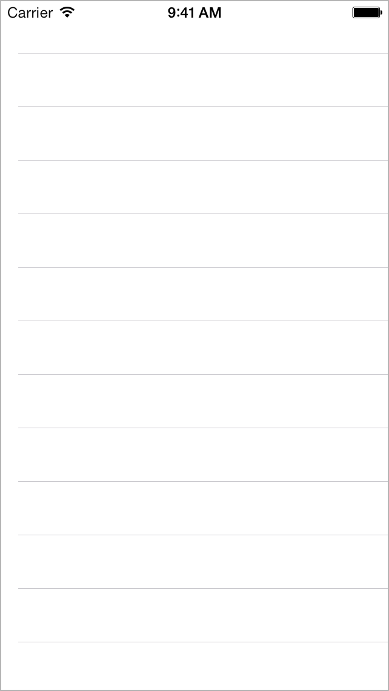

## 在表格视图中显示静态内容

由于您尚未学习如何储存数据，因此要创建和储存待办事项，并将它们显示在表格视图中还为时过早。但是要展示用户界面原型，并不需要用到真实数据。Xcode 允许您通过 Interface Builder 在表格视图中创建静态内容。此功能便于您查看用户界面的表现，并且对于尝试不同的设计概念来说也很有价值。

在表格视图中创建静态单元格

- 在界面的大纲视图中，选择“Table View Controller”下方的“Table View”。
- 表格视图选定后，请打开实用工具区域中的“Attributes”检查器 。
- 在“Attributes”检查器中，从“Content”选项旁的弹出式菜单中选取“Static Cells”。
- 表格视图中将出现三个空的表格视图单元格。
- 在大纲视图中或画布上，选择顶部单元格。
- 在“Attributes”检查器中，从“Style”选项旁的弹出式菜单中选取“Basic”。
- “Basic”样式包括标签，因此 Xcode 将在表格单元格中创建一个带有“Title”文本的标签。
- 在大纲视图中或画布上，选择该标签。
- 在“Attributes”检查器中，将标签文本从“Title”更改为“Mow the Lawn”。请按下 Enter 键，或点按实用工具区域的外部，使更改生效。
或者，您可以通过连按两下标签，然后直接编辑文本来编辑标签。
- 对于其他单元格，请重复步骤 4–7，并根据其他类似的待办事项给单元格安排文本。
- 请创建足够的单元格，使项目数量超过屏幕的显示范围。您可以通过拷贝和粘贴来创建新单元格，或通过按住 Option 键拖移单元格来进行创建。

检查点：运行您的应用程序。现在，您应该能看到一个表格视图，其中含有在 Interface Builder 中添加的预先配置的单元格。可以查看一下新表格视图在滚动时的整体效果。试试旋转模拟设备，注意观察单元格视图如何配置，才对其内容进行了正确布局。在表格视图中，您可以自由地进行大量操作。

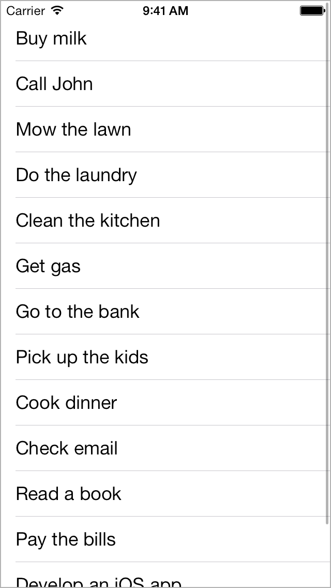

完成后，应该设计如何从这个表格视图及其待办事项列表，浏览到您所创建的首个场景（即用户可以创建新待办事项的场景）。

## 添加过渡以向前浏览

您已经在串联图中配置了两个视图控制器，但它们彼此之间没有连接。场景之间的转场，我们称为过渡。

创建过渡前，您需要先配置场景。首先，在导航控制器中包括待办事项列表表格视图控制器。回想之前的“[定义交互](define-the-interaction.md)”，我们知道导航控制器能提供导航栏，并且能够跟踪导航堆栈。您将在“add-to-do-item”场景的转场中添加导航栏按钮。

将导航控制器添加到表格视图控制器

- 在大纲视图中，请选择“Table View Controller”。
- 视图控制器选定后，请选取“Editor”>“Embed In”>“Navigation Controller”。

Xcode 能给串联图添加新的导航控制器、为其设定初始场景，并在新的导航控制器和现有的表格视图控制器之间建立关系。在画布上，如果您选择了连接两个场景的图标，就会发现这其实是一种根视图控制器关系。这表示导航栏下方显示的内容视图将为表格视图。初始场景设定为导航控制器，因为导航控制器保留了将显示在应用程序中的所有内容，它是待办事项列表和“add-to-do-item”场景的容器。

检查点：运行您的应用程序。在表格视图上方，您将看到额外的区域。这是导航控制器所提供的导航栏。

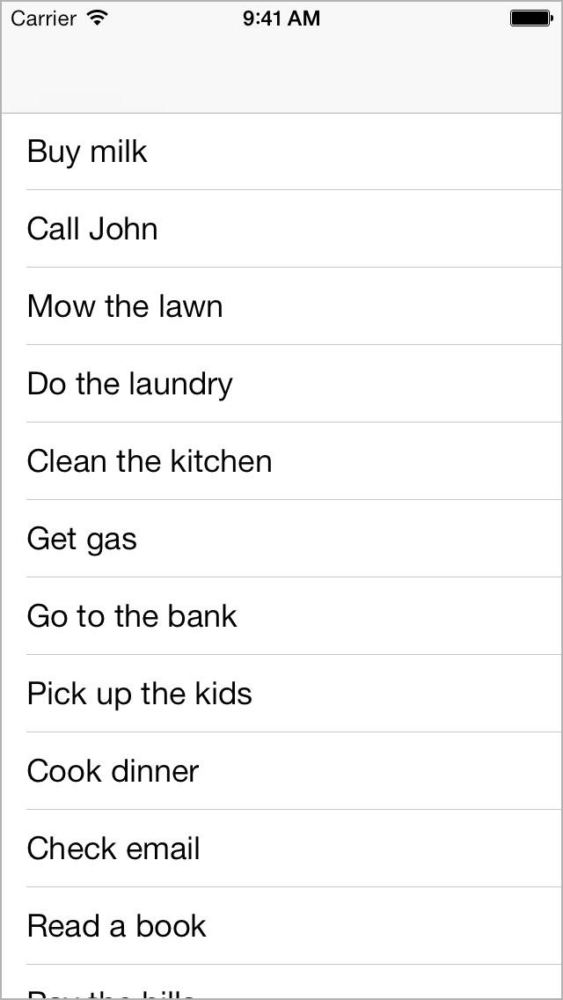

现在，您将为导航栏添加标题（关于待办事项列表）和按钮（用于添加更多待办事项）。


### 配置导航栏

- 在大纲视图中或画布上，选择“Table View Controller”下方的“Navigation Item”。
导航栏本身并不带标题，它们的标题来自导航控制器当前显示的视图控制器。您需要使用待办事项列表的导航项目（表格视图控制器）来设定标题，而不是直接在导航栏上设定。
- 在“Attributes”检查器中，在“Title”栏键入“My To-Do List”。
- 如有需要，请打开对象库。
- 在表格视图控制器中，将“Bar Button Item”对象从列表拖到导航栏的最右端。在您拖移栏按钮项目的位置，将出现一个包含“Item”文本的按钮。
- 在大纲视图或画布上，选择栏按钮项目。
- 在“Attributes”检查器中，找到“Bar Button Item”部分中的“Identifier”选项。从“Identifier”弹出式菜单中，选取“Add”。

该按钮将变成添加按钮 (+)。

检查点：运行您的应用程序。导航栏现在应该有了标题，并显示有一个添加按钮。该按钮暂时没有任何作用。之后您将修复这个问题。


您想让添加按钮调用“add-to-do-item”场景。该场景已经配置好了，它正是您所创建的首个场景，只是还没有连接其他场景。通过 Xcode，您能轻松地配置添加按钮，使其轻按一下便可调出其他场景。

### 配置添加按钮

- 在画布上，选择添加按钮。
- 按住 Control 键从按钮拖到“add-to-do-item”视图控制器。

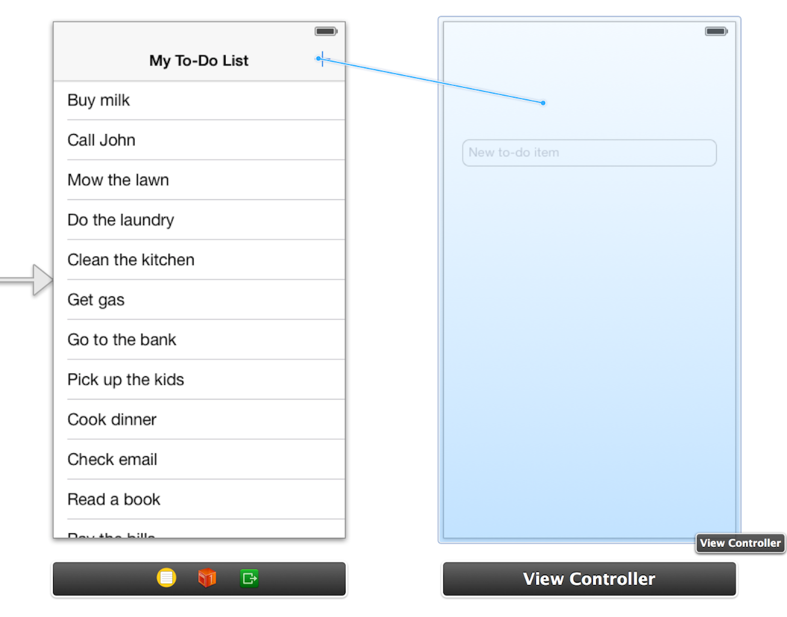

拖移停止的位置，将出现一个标题为“Action Segue”的快捷菜单。

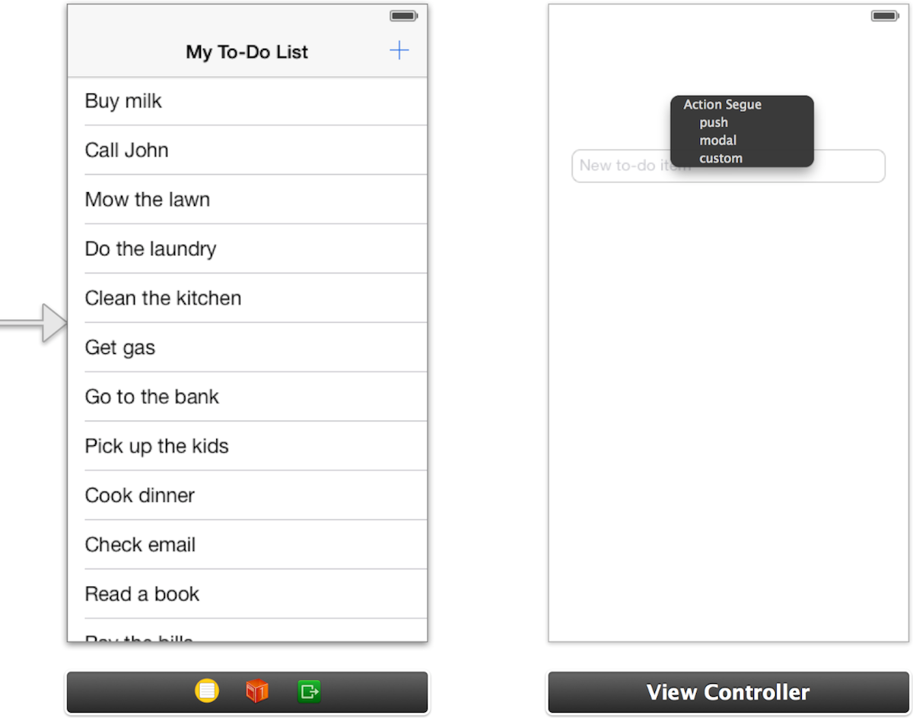

通过该菜单，Xcode 能让您选取当用户轻按添加按钮时，待办事项列表到“add-to-do-item”视图控制器之间的转场所使用的过渡类型。

- 从快捷菜单中选取“push”。

Xcode 将设置过渡，并将“add-to-do-item”视图控制器配置为显示在导航控制器中，您将在 Interface Builder 中看到导航栏。

现在，项目中可能出现了数个警告。请继续并打开“Issue”导航器来查看问题所在。

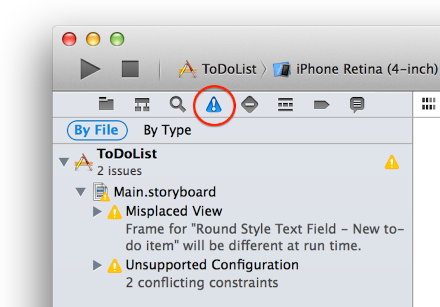

由于您将“add-to-do-item”场景添加到了导航堆栈，它现在将显示导航栏。该栏将导致您文本栏的边框下移，从而无法满足之前指定的 Auto Layout 约束。好在这并不难解决。

### 更新 Auto Layout 约束

1.在大纲视图或画布上，选择文本栏。

2.在画布上，打开“Resolve Auto Layout Issues”弹出式菜单 ，然后选取“Update Constraints”。
或者，您可以选取“Editor”>“Resolve Auto Layout Issues”>“Update Constraints”。
约束将更新，同时 Xcode 警告会消失。

检查点：运行您的应用程序。您可以点按添加按钮，并浏览到表格视图中的“add-to-do-item”视图控制器。由于您使用的是带 push 过渡的导航控制器，因此向后导航已为您处理完毕。这表示您可以通过点按返回按钮来回到表格视图。

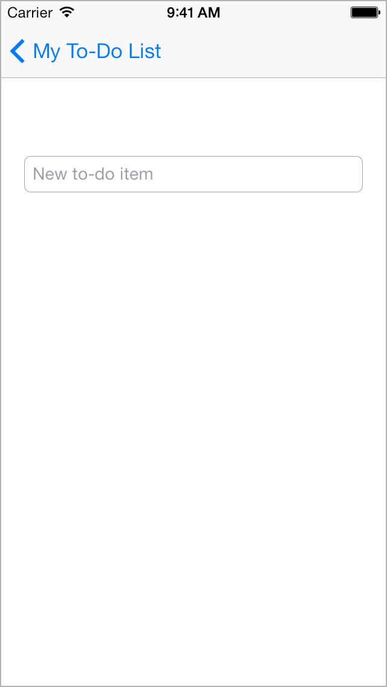

一般情况下，push 导航的功能是正常的，但添加项目时则不太一样。Push 导航设计用于深层次界面，即无论用户选定哪一项，您都能为其提供更多相关信息。而另一方面，添加项目是一种模态操作，即用户执行某个完整且自包含的操作，然后从场景返回到主导航。此类型场景恰当的表述方式为 modal 过渡。

### 更改过渡样式

- 在大纲视图中或画布上，选择表格视图控制器到“add-to-do-item”视图控制器的过渡。
- 在“Attributes”检查器中，从“Style”选项旁的弹出式菜单中选取“Modal”。

Modal 视图控制器不会添加到导航堆栈，因此它没有从表格视图控制器的导航控制器中获得导航栏。但是您可能想要保留导航栏，给予用户视觉上的连续性。要在模态展示时为“add-to-do-item”视图控制器添加导航栏，请将它嵌入其自身的导航控制器中。

### 将导航控制器添加到“add-to-do-item”视图控制器

- 在大纲视图中，请选择“View Controller”。
- 视图控制器选定后，请选取“Editor”>“Embed In”>“Navigation Controller”。

和之前一样，Xcode 会在视图控制器的顶部添加导航控制器，并显示导航栏。接着，配置此栏以将标题及“Cancel”和“Done”这两个按钮添加到该场景。稍后，会将这些按钮链接到操作。

### 配置“add-to-do-item”视图控制器中的导航栏

- 在大纲视图中或画布上，选择“View Controller”下方的“Navigation Item”。如有需要，请打开“Attributes”检查器。
- 在“Attributes”检查器中，在“Title”栏键入“Add To-Do Item”。
Xcode 会将视图控制器的描述从“View Controller”更改为“View Controller – Add To-Do Item”，方便您辨别场景。描述将出现在大纲视图中。
- 在“add-to-do-item”视图控制器中，将“Bar Button Item”对象从对象库拖到导航栏的最右端。
- 在“Attributes”检查器中，从“Identifier”选项旁的弹出式菜单中选取“Done”。
按钮文本将更改为“Done”。
- 在“add-to-do-item”视图控制器中，将另一个“Bar Button Item”对象从对象库拖到导航栏的最左端。
- 在“Attributes”检查器中，从“Identifier”选项旁的弹出式菜单中选取“Cancel”。
按钮文本将更改为“Cancel”。

检查点：运行您的应用程序。点按添加按钮。您仍将看到添加项目场景，但返回浏览待办事项列表的按钮将消失，取而代之的是您添加的“Done”和“Cancel”这两个按钮。这些按钮尚未链接到任何操作，因此您虽然可以点按它们，但不会有任何反应。下个任务，我们将配置按钮以完成或取消编辑新的待办事项，并使用户返回待办事项列表。

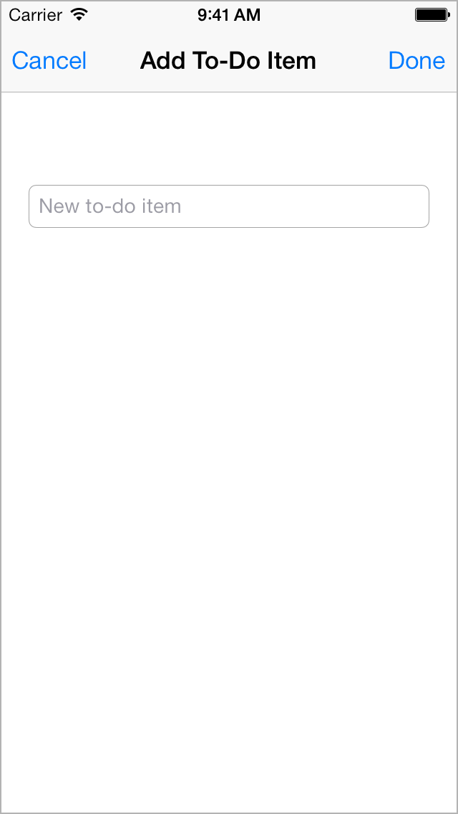

## 创建自定视图控制器

至今您所完成的配置工作，都无需编写任何代码。不过，配置整个“add-to-do-item”视图控制器还是需要代码的，同时还得有放代码的位置。此时，Xcode 已将“add-to-do-item”视图控制器，以及表格视图控制器，配置为基本的视图控制器。如果给自定代码预留位置，您需要为每一个视图控制器创建子类，然后配置界面以使用这些子类。

首先，需要处理“add-to-do-item”视图控制器场景。自定视图控制器类的名称为 `XYZAddToDoItemViewController`，因为此视图控制器所控制的场景，会为您的待办事项列表添加新项目。

### 创建 UIViewController 的子类

1. 请选取“File”>“New”>“File”（或按下 Command-N）。
2. 在出现的对话框左侧，选择“iOS”下方的“Cocoa Touch”模板。
3. 选择“Objective-C Class”，然后点按“Next”。
4. 在“Class”栏中，在 XYZ 前缀之后键入 AddToDoItem。
5. 选取“Subclass of”弹出式菜单中的 UIViewController。
类标题将变更为“XYZAddToDoItemViewController”。创建自定视图控制器时，Xcode 能帮您清楚区分出该名称。好的，那这个新名称可以不用管了。
6. 请确定“Targeted for iPad”和“With XIB for user interface”选项并未选定。
7. 点按“Next”。
8. 存储位置默认为您的项目目录。保持该项不变。
9. “Group”选项默认为您的应用程序名称，“ToDoList”。保持该项不变。
10. 在“Targets”部分中，应用程序默认为选定，而应用程序的测试默认为未选定。很好，那这一项也保持不变。
11. 点按“Create”。

现在，自定视图控制器的子类已经创建，您需要让串联图使用自定类，而不是使用基本视图控制器。串联图文件是应用程序运行时所使用的对象的相关配置。应用程序的运行机理，能将串联图最初使用的基本视图控制器，智能地替换成自定视图控制器，但首先您需要向串联图下达该命令。

将类识别为某个场景的视图控制器

- 在项目导航器中，请选择 Main.storyboard。
- 如有需要，请打开大纲视图 。
- 在大纲视图中，选择“View Controller – Add To-Do Item”视图控制器。
点按“View Controller – Add To-Do Item”场景旁的显示三角形来显示场景中的对象。第一个对象应该是视图控制器。点按以选择它。注意场景行的图标与视图控制器行的图标并不相同。
- 选定视图控制器后，请打开实用工具区域中的“Identity”检查器 。
当您点按左起第三个按钮时，“Identity”检查器将出现在实用工具区域的顶部。它能让您编辑串联图中对象的属性（与对象的识别信息相关），例如它是什么类。

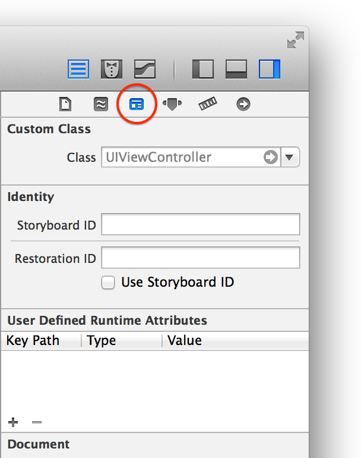

- 在“Identity”检查器中，打开“Class”选项旁的弹出式菜单。
您将看到一个列表，其中包含了所有 Xcode 了解的视图控制器类。列表的最后一个应该是自定视图控制器 XYZAddToDoItemViewController。选取它，从而让 Xcode 为此场景使用视图控制器。

运行时，串联图将创建 XYZAddToDoItemViewController 的实例，即您的自定视图控制器子类来代替基本的 UIViewController。请注意 Xcode 已将“add-to-do-item”视图控制器场景的描述，从“View Controller – Add To-Do Item”更改为“Add To Do Item View Controller – Add To-Do Item”。Xcode 知道此场景当前正在使用自定视图控制器，因此它解释了自定类的名称，以方便您理解串联图上的内容。

现在，请对表格视图控制器执行相同操作。

### 创建 UITableViewController 的子类

- 请选取“File”>“New”>“File”（或按下 Command-N）。
- 在左侧选择“iOS”下方的“Cocoa Touch”,然后选择“Objective-C Class”。如果在本教程前面的步骤中您尚未创建任何类，那么 Xcode 可能已经为您选好了一个。
- 点按“Next”。
- 在“Class”栏中，键入“ToDoList”。请注意 Xcode 将插入点放置在 XYZ（类前缀）和 ViewController（所创建的项目类型）之间。
- 从“Subclass of”弹出式菜单中选取 UITableViewController。
- 请确定“Targeted for iPad”和“With XIB for user interface”选项并未选定。
- 点按“Next”。
存储位置默认为您的项目目录。保持该项不变。
- “Group”选项默认为您的应用程序名称，“ToDoList”。保持该项不变。
- 在“Targets”部分中，应用程序默认为选定，而应用程序的测试默认为未选定。很好，那这一项也保持不变。
- 点按“Create”。

请再次确定，已在串联图中配置了自定表格视图控制器 XYZToDoListViewController。

### 配置串联图

- 在项目导航器中，选择 Main.storyboard。
- 如有需要，请打开大纲视图。
- 在大纲视图中，选择表格视图控制器，然后打开实用工具区域中的“Identity”检查器 。
- 在“Identity”检查器中，从“Class”选项旁的弹出式菜单中选取 XYZToDoListViewController。

现在，您可以给视图控制器添加自定代码了。

## 跳转过渡以返回

除了 push 和 modal 过渡外，Xcode 还提供 unwind 过渡。此过渡允许用户从一个给定场景返回上一个场景，并提供位置让您添加代码，以在用户导航切换场景时执行。您可以使用 unwind 过渡从 XYZAddToDoItemViewController 返回浏览 XYZToDoListViewController。

通过向目的视图控制器（要跳转到的视图控制器）添加操作方法，可以创建 unwind 过渡。可以跳转到的方法必须返回一个操作 (IBAction)，并且在串联图过渡 (UIStoryboardSegue) 中作为参数采用。您可能想跳转回 XYZToDoListViewController，因此需要将带有该格式的操作方法添加到 XYZToDoListViewController 界面并进行实现。

### 跳转回 XYZToDoListViewController

- 在项目检查器中，打开 XYZToDoListViewController.h。
- 在 @interface 行下方添加以下代码：
- 
```
- (IBAction)unwindToList:(UIStoryboardSegue *)segue;
```

- 在项目检查器中，打开 XYZToDoListViewController.m。
- 在 @implementation 行下方添加以下代码：

```
- (IBAction)unwindToList:(UIStoryboardSegue *)segue
{
 
}
```

您可以给跳转操作随意命名。可以将它命名为 unwindToList:，让跳转操作返回的位置一目了然。对于今后的项目，可以采用类似的命名惯例，即操作的名称能清楚表示跳转操作将返回的位置。

当前项目中，请将此方法实现留空。稍后，您将使用此方法从 XYZAddToDoItemViewController 中取回数据，以将项目添加到待办事项列表。

若要创建 unwind 过渡，请通过源视图控制器 XYZAddToDoItemViewController 场景台中的“Exit”图标，将“Cancel”和“Done”按钮链接到 unwindToList: 操作。

### 将按钮链接到“unwindToList:”操作

- 在项目导航器中，选择 Main.storyboard。
- 在画布上，按住 Control 键从“Cancel”按钮拖到“add-to-do-item”场景台中的“Exit”项。

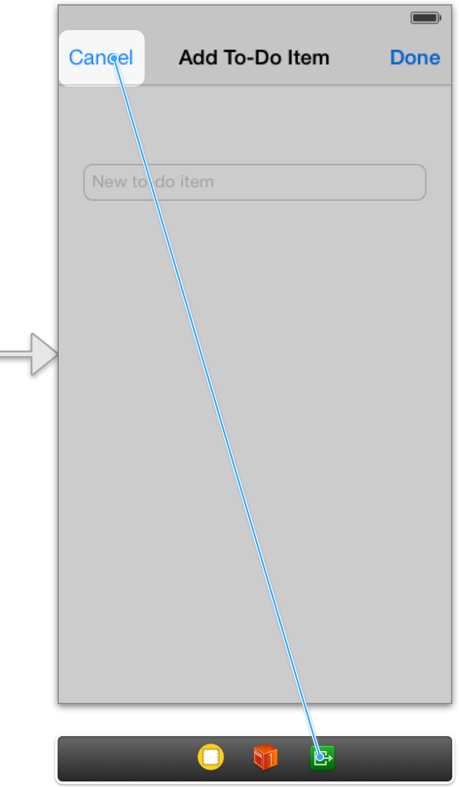

如果您在场景台中看到的是场景的描述，而不是“Exit”项，请点按画布上的“放大”image: ../Art/zoom_in_2x.png 按钮，直到看到该项为止。

一个菜单将出现在拖移停止的位置。

- 从快捷菜单中选取 unwindToList:。

这是您刚才添加到 XYZToDoListViewController.m 文件的操作。表示当轻按“Cancel”按钮时，将跳转过渡并调用此方法。

- 在画布上，按住 Control 键从“Done”按钮拖到 XYZAddToDoItemViewController 场景台中的“Exit”项。

- 从快捷菜单中选取 unwindToList:。

请注意，“Cancel”和“Done”按钮使用了相同的操作。在下个教程中，您将在编写处理 unwind 过渡的代码时区分这两种情况。

检查点：现在，请运行应用程序。启动时，您将看到表格视图，但其中不含数据。您可以点按添加按钮，从 XYZToDoListViewController 浏览到 XYZAddToDoItemViewController。也可以点按“Cancel”和“Done”按钮返回浏览表格视图。

那为什么显示不了数据呢？表格视图有两种获取数据的方式，即静态获取或动态获取。当表格视图的控制器实现所要求的 UITableViewDataSource 方法时，表格视图将向其视图控制器请求数据以进行显示，不管 Interface Builder 中是否配置了静态数据。如果您留意下 XYZToDoListViewController.m，就会发现它实现了三种方法：numberOfSectionsInTableView:， tableView:numberOfRowsInSection:以及 tableView:cellForRowAtIndexPath:。您可以通过注释掉这些方法的实现，在表格视图中再次显示静态数据。如果感兴趣，您可以继续试试。

## 小结

现在，您已经完成了应用程序界面的开发工作。现在有两个场景：一个用于给待办事项列表添加项目，另一个用于查看该列表；并且您可以在两个场景之间浏览。接下来要实现的功能，是让用户添加新的待办事项，并使其显示在列表中。下一部分讲述了如何处理数据以实现该行为。
