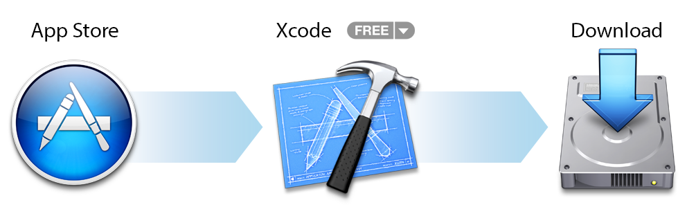

# 设置

## 获取工具

在着手开发精彩的应用程序之前，请先设置好开发环境，并确保工具齐备。

开发 iOS 应用程序，您需要：

- Mac 电脑，运行 OS X 10.8 (Mountain Lion) 或更高版本
- Xcode
- iOS SDK

Xcode 是 Apple 的集成开发环境 (IDE)。Xcode 包括源代码编辑器、图形用户界面编辑器和许多其他功能。iOS SDK 扩展了 Xcode 工具集，包含 iOS 开发专用的工具、编译器和框架。

您可以从 Mac 上的 App Store 中免费下载最新版本的 Xcode。（下载 Xcode 需要 OS X v10.8。如果您使用的是较早版本的 OS X，请升级。）Xcode 中包含了 iOS SDK。

下载最新版本的 Xcode

- 请打开 Mac 上的 App Store 应用程序（默认位于 Dock 中）。
- 在右上角的搜索栏中，键入 Xcode，然后按下 Return 键。
- 点按“免费”。

Xcode 将下载到您的 /Applications 目录中。