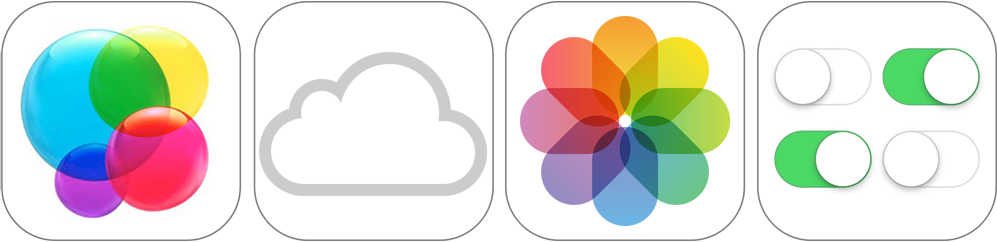

# iOS 技术

之前您已了解了如何编写一个具有简单用户界面和基本行为的应用程序。现在您或许在考虑实现更多的行为，使项目成为一款功能完备的应用程序。

在思考要添加哪些功能之前，谨记一条：您无需一切从头开始。iOS 提供了定义特殊功能集的框架，从游戏、媒体到密保和数据管理，每样均可以整合到您的应用程序中。您已使用 UIKit 框架来设计应用程序的用户界面，并使用 Foundation 框架将常见数据结构和行为归并到代码。这是 iOS 应用程序开发中两个最常用的框架，而您能使用的远不止这些。

本章节大致概述了可能在应用程序中采用的技术和框架。您不妨将本章节当做探索可行技术的起点。有关 iOS 中可用技术的完整概述，请参阅[《iOS Technology Overview》](https://developer.apple.com/library/ios/documentation/Miscellaneous/Conceptual/iPhoneOSTechOverview/Introduction/Introduction.html#//apple_ref/doc/uid/TP40007898)（iOS 技术概述）。

## 数据

处理应用程序数据时，请思考现有框架中有哪些可用的功能。

Core Data。Core Data 框架管理应用程序的数据模型。借助 Core Data，您可以创建模型对象（称为被管理的对象）。管理那些对象之间的关系，并通过框架更改数据。Core Data 利用内建的 SQLite 技术，高效地储存和管理数据。有关更多信息，请参阅《Core Data Framework Reference》（Core Data 框架参考）。

Foundation。您已在本指南的前文中接触过 Foundation。Foundation 框架定义了 Objective-C 类的最底层。除了提供一组基本且实用的对象类，本框架还介绍了数个范例来阐明 Objective-C 语言中未涉及的行为。与其他框架相比，本框架包括了表示基本数据类型的类（如字串和数字），以及用于储存其他对象的集类。有关更多信息，请参阅《Foundation Framework Reference》（Foundation 框架参考）。

## Media

Media 框架提供多种功能，用于处理应用程序中的音频和视频。

AV Foundation。AV Foundation 可用于播放和创建基于时间的音频视觉媒体，是数个具有该功能框架中的一个。例如，您可以使用 AV Foundation 来检查、创建、编辑媒体文件，或对其进行重新编码。您还可以通过它获取设备的输入流，以及在实时捕捉和回放过程中处理视频。有关更多信息，请参阅《AV Foundation Framework Reference》（AV Foundation 框架参考）。