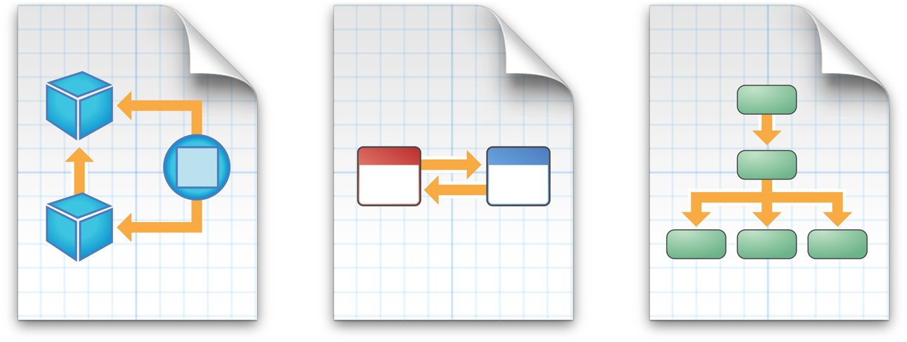
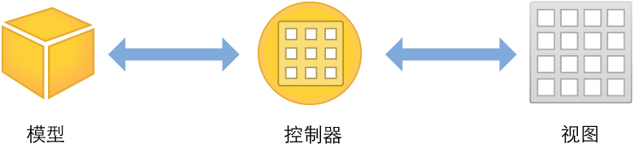
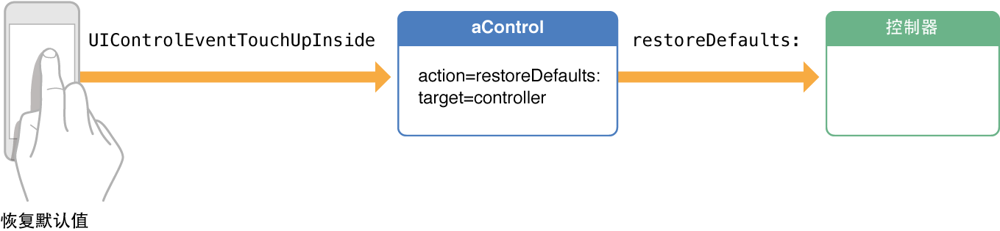
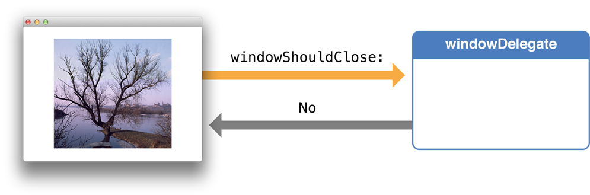

# 使用设计模式

设计模式可以解决常见的软件工程问题。模式是抽象设计，而非代码。采用一种设计，就是应用它的通用模式来满足您的特定需求。不管是创建哪种类型的应用程序，最好能先了解框架中使用的基本设计模式。了解设计模式有助于更高效地使用框架，并且可让您编写的程序复用程度更高、扩展能力更强和更容易修改。

## MVC

对于任何 iOS 应用程序而言，模型－视图－控制器 (MVC) 都是一个优秀设计的关键所在。MVC 会将应用程序中的对象分配给以下三种角色中的一种：模型、视图或者控制器。在这种模式中，模型会记录应用程序的数据，视图会显示用户界面并构成应用程序的内容，而控制器则会管理您的视图。通过响应用户的操作并使用内容填充视图，控制器充当了模型和视图二者之间通信的通道。

在构建 ToDoList 应用程序的过程中，您遵循的就是以 MVC 为中心的设计模式。在串联图中构建的界面组成了视图层 XYZAddToDoItemViewController 和 XYZToDoListViewController 就是管理视图的控制器。在添加数据中，您需要结合数据模型来处理应用程序中的视图和控制器。在开始设计自己的应用程序时，很重要的一点就是以 MVC 为中心进行设计。

## 目标-操作

目标-操作从概念上讲是一个简单的设计：特定事件发生时，一个对象会向另一个对象发送信息。操作信息就是在源代码中定义的选择器，而目标（即接收信息的对象）则是能够执行该操作的对象（通常为视图控制器）。发送操作信息的对象通常为控制，例如按钮、滑块或开关，它能够触发事件对用户的交互操作（例如轻按、拖移或者值更改）作出响应。

例如，假设您想要在每次用户轻按“恢复默认”按钮（在用户界面中创建）时恢复应用程序中的默认设置。首先，您需要实施操作 restoreDefaults: 来执行恢复默认设置的逻辑。接着，注册按钮的 Touch Up Inside 事件，将 restoreDefaults: 操作方法发送到实施该方法的视图控制器。

在 ToDoList 应用程序中，您已经使用过目标-操作模式。当用户轻按 XYZAddToDoItemViewController 中的“完成”按钮时，会触发 unwindToList: 操作。在这种情况下，“完成”按钮是发送信息的对象，目标对象是 XYZToDoListViewController，操作信息是 unwindToList:，而触发操作信息被发送的事件则是用户轻按“完成”按钮这一操作。目标-操作是定义交互以及在应用程序各部分之间发送信息的强大机制。

## 委托

委托是一种简单而强大的模式。在此模式中，应用程序中的一个对象代表另一个对象，或与另一个对象协调工作。授权对象保留对另一个对象（委托对象）的引用，并适时向委托对象发送信息。该信息会告诉事件的委托对象，授权对象即将处理或刚处理了某个事件。委托对象可能会对该信息作出如下响应：更新其本身或应用程序中其他对象的外观或状态，在某些情况下，它会返回一个值来反映待处理的事件该如何处理。

委托模式不仅普遍用于既有的框架类，而且也可应用在应用程序的两个自定对象之间。常见的设计是将委托作为一种手段，允许子视图控制器将某些值（通常为用户输入的值）传达到父视图控制器。

目前您还没有使用过委托，但是在“[教程：添加数据](add-data.md)”中，当您将其他行为添加到 XYZToDoListViewController 类时，这就是委托的示例。

在 iOS 应用程序的开发过程中，会经常遇到一些较为常见的设计模式，但它们只是冰山一角。随着对 Objective-C 学习的深入，您还会发现其他可在应用程序中使用的设计模式。