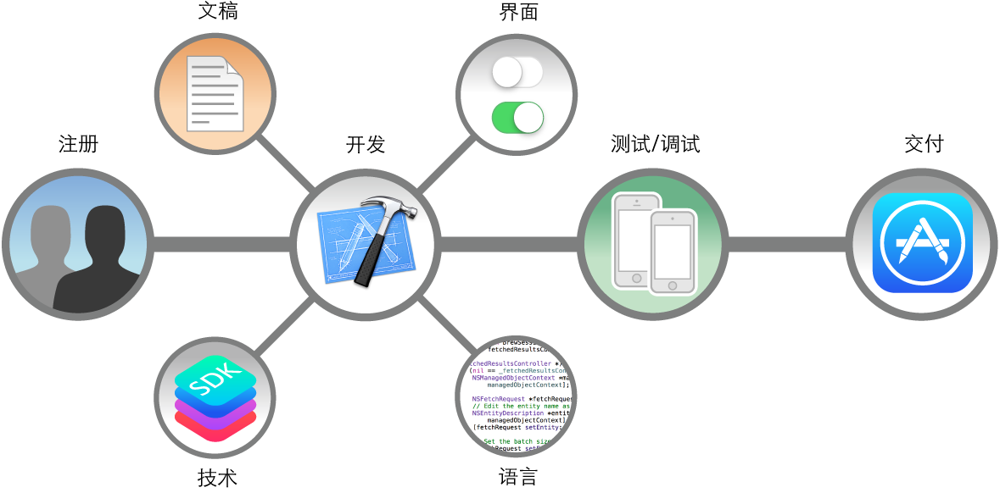

# 接下来做什么

在《 马上着手开发 iOS 应用程序》中，您学习了 iOS 应用程序开发的基础知识。现在，应该可以开发出您第一个功能完整的应用程序了。虽然将一个简单的概念转变成应用程序，再发布到 App Store 绝不简单，但是您在本文中学到的流程与实践，将帮助您找到正确的方向。

关于接下来做什么，这里有一些提示：

注册为开发者。

[《App Distribution Guide》](https://developer.apple.com/library/ios/documentation/IDEs/Conceptual/AppDistributionGuide/ManagingAccounts/ManagingAccounts.html#//apple_ref/doc/uid/TP40012582-CH24)（应用程序分发指南）中的“Managing Accounts”（管理帐户）会带您逐步完成注册为 Apple 开发者的过程。

学习设计美观的应用程序界面。

[《 iOS Human Interface Guidelines》](https://developer.apple.com/library/ios/documentation/UserExperience/Conceptual/MobileHIG/index.html#//apple_ref/doc/uid/TP40006556)（iOS 用户界面指南）会指导您如何让应用程序符合 iOS 用户界面规范。

学习语言。

[《Programming with Objective-C 》](https://developer.apple.com/library/ios/documentation/Cocoa/Conceptual/ProgrammingWithObjectiveC/Introduction/Introduction.html#//apple_ref/doc/uid/TP40011210)（使用 Objective-C 编程）描述了如何使用 Objective-C 程序设计语言定义类、发送消息、封装数据，以及完成各种其他任务。

学习开发优秀的应用程序。

[《App Programming Guide for iOS 》](https://developer.apple.com/library/ios/documentation/iPhone/Conceptual/iPhoneOSProgrammingGuide/Introduction/Introduction.html#//apple_ref/doc/uid/TP40007072)（iOS 应用程序编程指南）讲解了在开发 iOS 应用程序时，您必须要了解并做到的基本事项。

了解可用的技术。

[《iOS Technology Overview 》](https://developer.apple.com/library/ios/documentation/Miscellaneous/Conceptual/iPhoneOSTechOverview/Introduction/Introduction.html#//apple_ref/doc/uid/TP40007898)（iOS 技术概述）介绍了可以在 iOS 应用程序中使用的框架和其他技术。

浏览文稿。
“[查找信息](find-information.md)”讲解了如何充分利用所提供的文稿。

调试并测试您的应用程序。

[《Xcode Overview 》](https://developer.apple.com/library/ios/documentation/ToolsLanguages/Conceptual/Xcode_Overview/DebugYourApp.html#//apple_ref/doc/uid/TP40010215-CH18)（Xcode 概述）中的“Debug Your App”（“调试您的应用程序”）会教您如何在 Xcode 中彻底调试和测试应用程序。

发布应用程序。

[《App Distribution Guide》](https://developer.apple.com/library/ios/documentation/IDEs/Conceptual/AppDistributionGuide/Introduction/Introduction.html#//apple_ref/doc/uid/TP40012582)（应用程序分发指南）会带您逐步完成这些过程：预备测试设备，提交应用程序到 App Store。

## 让 ToDoList 应用程序提高一个档次

您刚创建的待办事项列表应用程序得益于多个内建行为。您可以继续体验此应用程序、巩固理解，或者开发一些新东西。如果要继续做待办事项列表应用程序，需要探究以下几个方面：

- 现在退出并重启应用程序时，待办事项列表会消失。不妨探索一下让列表不消失的方法。
- 您为应用程序中的所有控制都使用了默认外观。UIKit 包括了许多控制自定外观的功能。不妨使用该技术体验一下不同的用户界面选项。
- 您已经可以让用户将项目添加到列表，并将项目标记为已完成，但用户还无法删除项目。表格视图具有支持编辑功能的内建行为，包括删除和重新排列行，您可以考虑集成到应用程序中。

随着 iOS 应用程序开发的继续，您将发现还有非常多的概念和技术需要钻研，包括本地化、可访问性和外观自定。就从您感兴趣的方向开始吧。记得边学习概念边学以致用。遇到有趣的新技术、框架或设计模式时，不妨写一个小应用程序来测试它，要大胆尝试。

开发应用程序涉及到方方面面，您可能会对此感到畏惧，但按本文稿中讲述的“分而治之”方式来做的话，会发现很快就能发布您的第一个应用程序了。在 App Store 中发布应用程序后，您可以不断地加入更多功能。只要不断创新，就能引起客户的注意，让他们对您的下一个杰作翘首企盼。