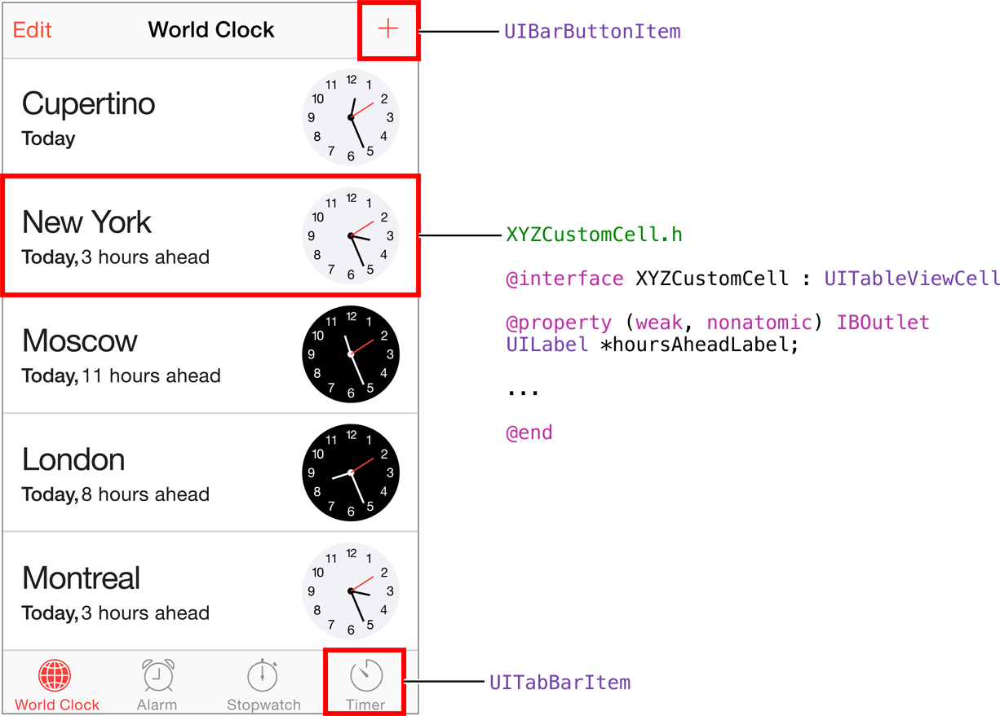

# 编写自定类

开发 iOS 应用程序时，很多情况下都需要编写自定类。当您需要将自定行为与数据打包在一起时，自定类非常有用。在自定类中，可以定义您自己的行为来储存、操控和显示数据。

例如，iOS 的“时钟”应用程序中的“世界时钟”标签。比起标准表格视图单元格，此表格视图中的单元格需要显示更多内容。这是实现子类的绝好机会，可以扩展 UITableViewCell 的行为，从而在给定的表格视图单元格中显示更多自定数据。如果要设计此自定类，您可能要为标签添加 Outlet，使信息前显示小时数；还要添加图像视图，使单元格的右侧显示自定时钟。



本章会告诉您需要了解哪些 Objective-C 语法和类结构，才能实现 ToDoList 应用程序的行为。还讨论了 XYZToDoItem 的设计，该自定类将表示待办事项列表上的单个项目。在第三个教程中，您将真正实现该类，并将它添加到您的应用程序中。

## 声明并实现类

在 Objective-C 中，类的说明需要两个不同的部分：接口和实现。接口准确指定了一个给定类型的对象，如何专用于其他对象。换句话说，它定义了类的实例与外部世界之间的公共接口。这个实现包括的可执行代码，涵盖了接口中声明的每个方法。

对象的设计，应当隐藏其内部实现的细节。在 Objective-C 中，接口和实现通常放在单独的文件中，这样您只需要将接口设定为公共属性。和 C 代码一样，您需要定义头文件和源代码文件，将公共声明与代码的实现细节分开。接口文件具有 .h 扩展名，实现文件具有 .m 扩展名。（您将在“[教程：添加数据](add-data.md)”中为 XYZToDoItem 类真正创建这些文件；眼下我们只需跟着文稿来，因为所有内容都将讲到。）

### 接口

Objective-C 语法经常采用以下方式来声明类接口：

```
@interface XYZToDoItem : NSObject
 
@end
```

该示例声明了名为 XYZToDoItem 的类，它继承自 NSObject。

公共属性和行为在 @interface 声明内部定义。在此示例中，除了超类外，没有指定任何内容，所以 XYZToDoItem 实例唯一可用的行为继承自 NSObject。所有对象都要有一个最基本的行为，因此在默认情况下，它们必须继承自 NSObject（或它的一个子类）。

### 实现

Objective-C 语法经常采用以下方式来声明类实现：

```
#import "XYZToDoItem.h"
 
@implementation XYZToDoItem
 
@end
```

如果您在类接口中声明了任何方法，那么需要在此文件中实现它们。

## 储存对象的数据的属性

考虑待办事项需要保存的信息。您可能需要知道事项的名称，创建时间，以及是否已经完成。在自定 XYZToDoItem 类中，此信息储存在属性中。

这些属性的声明在接口文件 (XYZToDoItem.h) 内部。如下所示：

```
@interface XYZToDoItem : NSObject
 
@property NSString *itemName;
@property BOOL completed;
@property NSDate *creationDate;
 
@end
```

在此示例中，XYZToDoItem 类声明了三个公共属性。这些属性完全可供公开访问。在公开访问的情况下，其他对象可以同时读取和更改这些属性的值。

您可能想要声明某个属性不能被更改（也就是说，只能读取）。指明一个属性是否只读（相对于其他属性），需要在 Objective-C 的属性声明中包括属性的特性。例如，如果您不想 XYZToDoItem 的创建日期被改变，可能需要将 XYZToDoItem 类接口更新为这样：

```
@interface XYZToDoItem : NSObject
 
@property NSString *itemName;
@property BOOL completed;
@property (readonly) NSDate *creationDate;
 
@end
```

属性可以是私有的或公共的。有时让属性私有是合理的选择，这样其他类就不能查看或访问它。例如，如果您想要跟踪的标记是项目完成的日期属性，并且不想让其他类访问此信息，请将此属性设为私有，方法是将它放在实现文件 (XYZToDoItem.m) 顶部的类扩展中。

```
#import "XYZToDoItem.h"
 
@interface XYZToDoItem ()
@property NSDate *completionDate;
@end
 
@implementation XYZToDoItem
 
@end
```

您可以使用 getter 和 setter 来访问属性。getter 返回属性的值，setter 更改属性的值。访问 getter 和 setter 的常见语法简写是 dot notation（点表达式）。对于具有读写访问权限的属性，您可以使用点表达式来获取和设定属性的值。如果您有 XYZToDoItem 类的一个对象 toDoItem，可以执行以下操作：

```
toDoItem.itemName = @"Buy milk";                 //Sets the value of itemName
NSString *selectedItemName = toDoItem.itemName;  //Gets the value of itemName
```

## 方法用来定义对象的行为

方法用来定义对象能做些什么。方法是您定义的一段代码，用来执行类中的任务或子程序。它可以访问类中储存的数据，并使用该信息来执行一些操作。

例如，要让待办事项 (XYZToDoItem) 能够被标记为已完成，您可以将 markAsCompleted 方法添加到类接口。稍后，您将在类实现中实现该方法的行为，正如“实现方法”中所述。

```
@interface XYZToDoItem : NSObject
 
@property NSString *itemName;
@property BOOL completed;
@property (readonly) NSDate *creationDate;
- (void)markAsCompleted;
 
@end
```

方法名称前面的减号 (-) 指示它是一个实例方法，可以用该类的对象调用。减号将它与类方法区分开来，类方法用加号 (+) 来表示。类方法可通过类本身来调用。类方法的一个常见示例是类工厂方法，您已经在“处理 Foundation”中学习过。您也可以使用类方法来访问与类相关的一些共享信息。

在声明的开始，用圆括号括住 void 关键词，表示方法不会返回值。这种情况下，markAsCompleted 方法没有任何参数。“方法参数”中会讲述有关参数的更多信息。

## 方法参数

在声明方法时加上参数，可在调用方法时传递一些信息。

例如，您可以根据之前的代码片段修改 markAsCompleted 方法，让其带单个参数，借此确定项目是否标记为完成或未完成。用这种方式，您可以切换项目的完成状态，而不只是将它设为完成。

```
@interface XYZToDoItem : NSObject
 
@property NSString *itemName;
@property BOOL completed;
@property (readonly) NSDate *creationDate;
- (void)markAsCompleted:(BOOL)isComplete;
 
@end
```

现在，您的方法采用了一个参数 isComplete，其类型为 BOOL。

通过名称引用带一个参数的方法时，冒号将作为方法名称的一部分，所以更新后的方法名称是 markAsCompleted:。如果方法有多个参数，那么它会被分解，并插入参数名称。如果要将另一个参数添加到此方法，其声明将会是这样的：

```
- (void)markAsCompleted:(BOOL)isComplete onDate:(NSDate *)date;
```

在这里，方法的名称写为 markAsCompleted:onDate:。实现时会使用名称 isComplete 和 date（会将这些名称当作变量），来访问方法被调用时所提供的值。

## 实现方法

方法实现使用大括号来包括相关代码。方法的名称必须与接口文件中的对应方法相同，并且参数和返回类型必须完全匹配。

这是添加到 XYZToDoItem 类接口的 markAsCompleted: 方法的简单实现：

```
@implementation XYZToDoItem
- (void)markAsCompleted:(BOOL)isComplete {
    self.completed = isComplete;
}
@end
```

与属性一样，方法也可以是私有的或公共的。公共方法在公共接口中声明，因此可以被其他对象查看和调用。它们的相应实现存在于实现文件中，其他对象看不到。私有方法仅有一个实现，并与类相同，这意味着只可以在类实现中调用它们。这是一个强大的机制，可将内部行为添加到类而不允许其他对象进行访问。

例如，假设您想要让待办事项的 completionDate 保持更新。当待办事项被标记为完成，就将 completionDate 设定为当前日期。当它被标记为未完成，就将 completionDate 设定为 nil，因为它尚未完成。由于更新待办事项的 completionDate 是自包含任务，所以最好的做法是为其编写专属方法。但是，应当确定其他对象不能调用此方法。否则，其他对象可以随时将待办事项的 completionDate 设定为任何内容。因此，请将此方法设为私有。

现在，更新 XYZToDoItem 的实现来包括私有方法 setCompletionDate，该方法将会在 markAsCompleted: 内部调用，以便在待办事项被标记为已完成或未完成时，更新待办事项的 completionDate。请注意，您不会添加任何内容到接口文件，因为不想其他对象看到此方法。

```
@implementation XYZToDoItem
- (void)markAsCompleted:(BOOL)isComplete {
    self.completed = isComplete;
    [self setCompletionDate];
}
- (void)setCompletionDate {
    if (self.completed) {
        self.completionDate = [NSDate date];
    } else {
        self.completionDate = nil;
    }
}
@end
```

现在，您已经使用 XYZToDoItem 类定义了待办事项列表的基本实现。XYZToDoItem 以属性的形式储存自身相关的信息——名称、创建日期和完成状态，并且会使用方法定义行为——被标记为已完成或未完成。这是您在下一个教程中实现 ToDoList 应用程序所需的功能扩展。不过，您随时可以尝试将自己的属性和方法添加到类，将新的行为集成到您的应用程序中。


